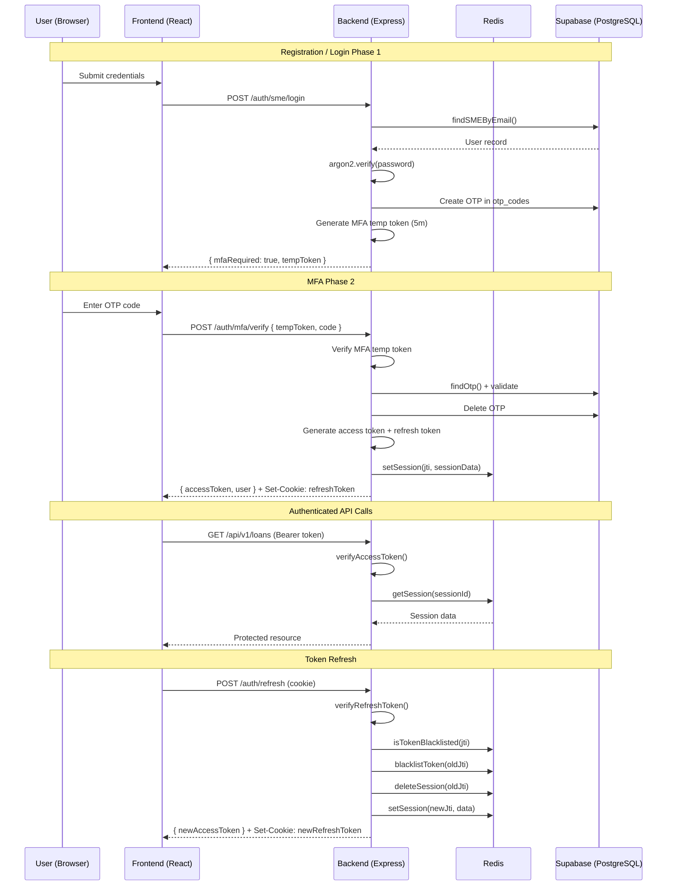

# CapitalScale — Q&A Knowledge Base

> This document maintains all Q&A pairs discussed during development. Each question is numbered sequentially with a detailed answer.

---

## Q1. Give me a very detailed report on the authentication we have in this project

### 1. Architecture Overview

The authentication system follows a **two-phase login flow with mandatory MFA (Multi-Factor Authentication)** across two distinct user types — **SME Applicants** and **Bank Administrators**. The system is built on:

| Layer                | Technology                                                                                                  |
| -------------------- | ----------------------------------------------------------------------------------------------------------- |
| **Password Hashing** | Argon2 (via [`argon2`](file:///e:/Desktop/Web%20Development/CapitalScale/backend/package.json) npm package) |
| **Token Management** | JWT (`jsonwebtoken`) — access tokens + refresh tokens                                                       |
| **Session Store**    | Redis (`ioredis`) — server-side session + token blacklisting                                                |
| **Database**         | Supabase (PostgreSQL) — user tables, roles, permissions, OTPs                                               |
| **Input Validation** | Zod schemas                                                                                                 |
| **Rate Limiting**    | `express-rate-limit`                                                                                        |
| **HTTP Security**    | Helmet, CORS, HttpOnly cookies                                                                              |
| **Frontend State**   | Zustand (persisted) + React Context                                                                         |

---

### 2. User Types & Roles

Defined in [auth.js](file:///e:/Desktop/Web%20Development/CapitalScale/backend/src/middleware/auth.js#L11-L15):

```js
export const ROLES = Object.freeze({
  SME: 'sme',
  BANK_ADMIN: 'bank_admin',
  SUPER_ADMIN: 'super_admin',
});
```

Each user type has its own database table:

- **`sme_users`** — SME loan applicants (fields: `full_name`, `business_name`, `phone`, `email`, `password_hash`, `role_id`, `address`, `is_verified`, `is_active`, `is_deleted`, etc.)
- **`bank_admin_users`** — Bank administrators/underwriters (fields: `bank_name`, `branch_name`, `branch_address`, `ifsc_code`, `admin_name`, `email`, `phone`, `password_hash`, `role_id`, `is_active`, `is_deleted`, etc.)

Roles are also stored in a **`roles`** table and referenced via `role_id` foreign key. On registration:

- SME users get the `sme_applicant` role
- Bank admins get the `bank_underwriter` role

A separate **`role_permissions`** junction table and **`permissions`** table enable granular permission-based authorization (see [users.queries.js#L161-L173](file:///e:/Desktop/Web%20Development/CapitalScale/backend/src/db/queries/users.queries.js#L161-L173)).

---

### 3. Authentication Flow (Step by Step)

#### 3.1 Registration

**SME Registration** (`POST /api/v1/auth/sme/register`):

1. Request passes through `authRateLimiter` (max 10 requests / 15 min) → `validate(smeRegisterSchema)` (Zod)
2. [auth.service.js#L34-L53](file:///e:/Desktop/Web%20Development/CapitalScale/backend/src/services/auth.service.js#L34-L53):
   - Checks for duplicate email via `findSMEByEmail()`
   - Looks up the `sme_applicant` role from the `roles` table
   - Hashes password with **Argon2**: `argon2.hash(password)`
   - Creates the user in `sme_users` table
   - Generates a 6-digit OTP, hashes it with HMAC-SHA256, and stores the hash in the `otps` table (expires in 5 min). Plaintext is never stored.
   - Generates a short-lived **MFA temp token** (JWT, 5 min expiry) signed with a dedicated `JWT_MFA_SECRET`
   - Returns `{ mfaRequired: true, tempToken, user }` — the user is **NOT** logged in yet

**Bank Admin Registration** (`POST /api/v1/auth/bank/register`):

- Same flow but creates in `bank_admin_users` with `bank_underwriter` role
- See [auth.service.js#L72-L91](file:///e:/Desktop/Web%20Development/CapitalScale/backend/src/services/auth.service.js#L72-L91)

**Audit Logging**: Both registration flows fire a non-blocking `recordAuditLog()` call (see [auth.controller.js#L27-L40](file:///e:/Desktop/Web%20Development/CapitalScale/backend/src/controllers/auth.controller.js#L27-L40)).

#### 3.2 Login (Phase 1 — Credential Verification)

**SME Login** (`POST /api/v1/auth/sme/login`):

1. Rate limited + validated with `loginSchema`
2. [auth.service.js#L55-L68](file:///e:/Desktop/Web%20Development/CapitalScale/backend/src/services/auth.service.js#L55-L68):
   - Finds user by email (including `password_hash`)
   - Checks `is_active` flag — throws `403 Forbidden` if deactivated
   - Verifies password with `argon2.verify()`
   - Generates OTP → hashes it → stores hash in DB → generates MFA temp token
   - Returns `{ mfaRequired: true, tempToken }` — **no session yet**

**Bank Admin Login** (`POST /api/v1/auth/bank/login`): Same pattern.

> [!IMPORTANT]
> Login does NOT issue access/refresh tokens. It only issues a temporary MFA token. The user must complete OTP verification to get actual session tokens.

#### 3.3 MFA Verification (Phase 2 — Session Creation)

**Endpoint**: `POST /api/v1/auth/mfa/verify`

This is the critical step where the session is actually created. See [auth.service.js#L110-L158](file:///e:/Desktop/Web%20Development/CapitalScale/backend/src/services/auth.service.js#L110-L158):

1. Verifies the MFA temp token (JWT)
2. **Distributed Lock**: Acquires a Redis lock (`acquireOtpLock`) to prevent concurrent brute-force race conditions.
3. Looks up the OTP record from `otps` table by `user_id` + `contact`
4. **Expiry check**: if OTP has expired, deletes it and throws error
5. **Code check**: Hashes the input code and compares it to the stored hash using constant-time `timingSafeEqual()`. If wrong, increments `attempts` counter.
   - If `attempts >= 3`, deletes the OTP entirely → user must re-login
5. On success:
   - Deletes the OTP
   - Fetches the full user from DB, verifies `is_active`
   - Updates `last_login_at`
   - Builds a JWT payload via `buildTokenPayload()` containing: `id`, `email`, `role`, `role_id`, `bank_name`, `admin_name`, `business_name`
   - Generates a **UUID v4 JTI** (JSON Token ID) used as `sessionId`
   - Creates **access token** (signed with `JWT_SECRET`, default 7d expiry)
   - Creates **refresh token** (signed with `JWT_REFRESH_SECRET`, default 30d expiry, same JTI)
   - Creates a **Redis session** keyed by the JTI, storing: `userId`, `email`, `role`, `ipAddress`, `userAgent`, `createdAt` (TTL: 30 days)
   - Sets the refresh token as an **HttpOnly cookie**
6. Returns `{ user, accessToken, refreshToken }` — user is now fully authenticated

---

### 4. Token Architecture

Defined in [token.utils.js](file:///e:/Desktop/Web%20Development/CapitalScale/backend/src/utils/token.utils.js):

| Token Type | Secret | Expiry | Purpose |
|---|---|---|---|
| **Access Token** | `JWT_SECRET` (min 32 chars) | `JWT_EXPIRES_IN` (default `2h`) | API request authentication via `Authorization: Bearer <token>`. Audience: `capitalscale:access` |
| **Refresh Token** | `JWT_REFRESH_SECRET` (separate key) | `JWT_REFRESH_EXPIRES_IN` (default `30d`) | Stored in HttpOnly cookie, used to rotate access tokens. Audience: `capitalscale:refresh` |
| **MFA Temp Token** | `JWT_MFA_SECRET` (separate key) | `5m` (hardcoded) | Short-lived, bridges login → OTP verification. Audience: `capitalscale:mfa` |

**Access Token Payload** (via [buildTokenPayload](file:///e:/Desktop/Web%20Development/CapitalScale/backend/src/utils/token.utils.js#L78-L86)):

```js
{
  id,            // user UUID
  email,
  role,          // 'sme' | 'bank_admin'
  role_id,       // FK to roles table
  bank_name,     // for bank admins
  admin_name,    // for bank admins
  business_name, // for SMEs
  sessionId,     // JTI — links to Redis session
  jti,           // unique JWT ID (separate from sessionId)
}
```

**Refresh Token Cookie** settings ([token.utils.js#L57-L65](file:///e:/Desktop/Web%20Development/CapitalScale/backend/src/utils/token.utils.js#L57-L65)):

```js
{
  httpOnly: true,                          // not accessible to JS
  secure: env.NODE_ENV === 'production',   // HTTPS only in prod
  sameSite: 'strict' in prod / 'lax' in dev,
  maxAge: 30 * 24 * 60 * 60 * 1000,       // 30 days
  path: '/api/v1/auth',                    // scoped to auth routes only
}
```

---

### 5. Session Management (Redis)

All session logic lives in [redis.js](file:///e:/Desktop/Web%20Development/CapitalScale/backend/src/config/redis.js):

| Operation                     | Redis Key Pattern       | TTL     |
| ----------------------------- | ----------------------- | ------- |
| `setSession(sessionId, data)` | `session:<jti>`         | 30 days |
| `getSession(sessionId)`       | `session:<jti>`         | —       |
| `deleteSession(sessionId)`    | `session:<jti>`         | —       |
| `blacklistToken(jti)`         | `blacklist:token:<jti>` | 30 days |
| `isTokenBlacklisted(jti)`     | `blacklist:token:<jti>` | —       |

**Session data stored**:

```js
{
  (userId, email, role, ipAddress, userAgent, createdAt, permissions); // lazily cached on first permission check
}
```

> [!NOTE]
> If Redis is unavailable (connection fails), all session functions gracefully degrade — `getSession` returns `null`, `setSession`/`deleteSession` become no-ops. Importantly, `isTokenBlacklisted` returns `true` (fail-safe deny) to prevent attackers from exploiting an outage to replay revoked tokens. This means the app won't crash but auth will effectively be disabled for security.

---

### 6. Token Refresh Flow (Rotation with Reuse Detection)

**Endpoint**: `POST /api/v1/auth/refresh`

This implements **refresh token rotation** — the most secure pattern for token management. See [auth.service.js#L162-L194](file:///e:/Desktop/Web%20Development/CapitalScale/backend/src/services/auth.service.js#L162-L194):

1. Reads refresh token from cookies (`req.cookies.refreshToken`) or request body
2. Verifies the refresh token with `JWT_REFRESH_SECRET`
3. **Reuse detection**: Checks if the JTI is blacklisted
   - If yes → **security alert**: logs a `security.token_reuse_fraud` audit event and rejects
4. Checks if a Redis session exists for this JTI
5. **Blacklists the old JTI** and **deletes the old session**
6. Looks up the user from DB, verifies `is_active`
7. Generates a **new JTI**, **new access token**, and **new refresh token**
8. Creates a **new Redis session** with the new JTI
9. Sets the **new refresh token** in an HttpOnly cookie
10. Returns `{ accessToken, refreshToken }`

> [!WARNING]
> **Token Reuse Detection**: If a previously used refresh token is re-presented, it's treated as a potential theft. The system logs a `security.token_reuse_fraud` audit event with the user's IP address. However, it does NOT invalidate all sessions — only the current one.

---

### 7. Middleware Stack

#### 7.1 `protect` Middleware ([auth.js#L21-L41](file:///e:/Desktop/Web%20Development/CapitalScale/backend/src/middleware/auth.js#L21-L41))

Applied to every protected route. It:

1. Extracts `Bearer <token>` from the `Authorization` header
2. Verifies the access token with `JWT_SECRET`
3. Checks if the session exists in Redis (via `decoded.sessionId`)
4. Attaches `req.user = decoded` (the full JWT payload)

#### 7.2 `authorizeRoles(...roles)` ([auth.js#L47-L60](file:///e:/Desktop/Web%20Development/CapitalScale/backend/src/middleware/auth.js#L47-L60))

Checks if `req.user.role` is in the allowed roles list. Throws `403 Forbidden` otherwise.

#### 7.3 `authorizePermissions(...perms)` ([auth.js#L67-L95](file:///e:/Desktop/Web%20Development/CapitalScale/backend/src/middleware/auth.js#L67-L95))

Fine-grained permission check:

1. Fetches session from Redis
2. Checks if permissions are cached in the session
3. If not, queries `role_permissions` → `permissions` tables and caches result in the Redis session
4. Verifies all required permissions are present

#### 7.4 Pre-composed Guards

| Guard                | Composition                                              | Used By                            |
| -------------------- | -------------------------------------------------------- | ---------------------------------- |
| `requireSME`         | `[protect, authorizeRoles('sme')]`                       | — (available but unused currently) |
| `requireBankAdmin`   | `[protect, authorizeRoles('bank_admin')]`                | —                                  |
| `requireSuperAdmin`  | `[protect, authorizeRoles('super_admin')]`               | —                                  |
| `requireBankOrSuper` | `[protect, authorizeRoles('bank_admin', 'super_admin')]` | Underwriting, Audit Logs           |
| `requireAuth`        | `[protect]`                                              | Underwriting (some routes)         |

---

### 8. Rate Limiting

Defined in [rateLimiter.js](file:///e:/Desktop/Web%20Development/CapitalScale/backend/src/middleware/rateLimiter.js):

| Limiter           | Window                                  | Max Requests                   | Applied To                      |
| ----------------- | --------------------------------------- | ------------------------------ | ------------------------------- |
| `rateLimiter`     | `RATE_LIMIT_WINDOW_MS` (default 15 min) | `RATE_LIMIT_MAX` (default 100) | All `/api` routes (global)      |
| `authRateLimiter` | 15 minutes                              | 10                             | Registration, login, MFA verify |
| `otpRateLimiter`  | 5 minutes                               | 5                              | Bank account OTP send           |

---

### 9. Input Validation (Zod Schemas)

Defined in [auth.validator.js](file:///e:/Desktop/Web%20Development/CapitalScale/backend/src/validators/auth.validator.js):

**Password Policy** (`strongPassword`):

- Minimum 12 characters
- At least 1 uppercase letter
- At least 1 number
- At least 1 special character

**SME Register Schema**: `full_name` (2-150), `business_name` (2-200), `phone` (international format), `email`, `password`, optional `address` object

**Bank Admin Register Schema**: `bank_name`, `branch_name`, optional `branch_address`, optional `ifsc_code` (max 11, uppercased), `admin_name`, `email`, optional `phone`, `password`

**Login Schema**: `email` + `password` (min 1 char)

The [validate](file:///e:/Desktop/Web%20Development/CapitalScale/backend/src/middleware/validate.js) middleware uses Zod's `safeParse()` and returns structured field-level errors on failure (HTTP 422).

---

### 10. Route-Level Authorization Map

| Route Group                      | Auth Middleware                                       | Role Restriction                     |
| -------------------------------- | ----------------------------------------------------- | ------------------------------------ |
| `POST /auth/sme/*`               | `authRateLimiter` only                                | Public                               |
| `POST /auth/bank/*`              | `authRateLimiter` only                                | Public                               |
| `POST /auth/mfa/verify`          | `authRateLimiter` only                                | Public                               |
| `POST /auth/refresh`             | None                                                  | Public (uses cookie)                 |
| `POST /auth/logout`              | `protect`                                             | Any authenticated user               |
| `GET /auth/me`                   | `protect`                                             | Any authenticated user               |
| `/loans/*`                       | `protect` (router-level)                              | Various per-route `authorizeRoles()` |
| `POST /loans/`                   | `protect` + `authorizeRoles(SME)`                     | SME only                             |
| `PATCH /loans/:id`               | `protect` + `authorizeRoles(BANK_ADMIN, SUPER_ADMIN)` | Bank/Super only                      |
| `DELETE /loans/:id`              | `protect` + `authorizeRoles(SUPER_ADMIN)`             | Super Admin only                     |
| `/banks/*`                       | `protect` + `authorizeRoles(SME)`                     | SME only                             |
| `/bank-policies/*`               | `protect` + `authorizeRoles(BANK_ADMIN)`              | Bank Admin only                      |
| `/ocr/*` (most)                  | `protect`                                             | Any authenticated user               |
| `PATCH /ocr/jobs/:id/vectorized` | **None**                                              | ⚠️ Public (no auth)                  |
| `/extraction/*` (callbacks)      | **None**                                              | ⚠️ Public (webhook callbacks)        |
| `/extraction/*` (triggers)       | `protect` + `authorizeRoles(BANK_ADMIN, SUPER_ADMIN)` | Bank/Super only                      |
| `/underwriting/*`                | `requireBankOrSuper` or `requireAuth`                 | Mixed                                |
| `/audit-logs`                    | `requireBankOrSuper`                                  | Bank/Super only                      |
| `/users/*`                       | **None**                                              | ⚠️ Not implemented, no auth          |

> [!CAUTION]
> **Unprotected Routes**: The following routes are publicly accessible without any authentication:
>
> - `PATCH /api/v1/ocr/jobs/:jobId/vectorized` — marks OCR jobs as vectorized
> - `PATCH /api/v1/extraction/loans/:loanId/extraction-status` — updates extraction status
> - `PATCH /api/v1/extraction/loans/:loanId/missing-info` — updates missing info
> - All `/api/v1/users/*` endpoints — user CRUD (stub, not implemented)
>
> These are likely designed as internal webhook/callback endpoints, but they lack API key or internal-only validation.

---

### 11. Frontend Authentication Architecture

#### 11.1 State Management — Zustand Store

[authStore.js](file:///e:/Desktop/Web%20Development/CapitalScale/frontend/src/store/authStore.js):

- State: `user`, `accessToken`, `isLoading`, `error`
- **Persistence**: Only `user` is persisted to `localStorage` (key: `ai-loan-auth`) — the access token is intentionally **not** persisted for security
- Helpers: `isAuthenticated()`, `hasRole(...roles)`, `getRoleLabel()`

#### 11.2 Auth Context — React Context Provider

[AuthContext.jsx](file:///e:/Desktop/Web%20Development/CapitalScale/frontend/src/context/AuthContext.jsx):

- Wraps the Zustand store with React Context
- Exposes methods: `loginSME()`, `loginBank()`, `registerSME()`, `registerBank()`, `verifyMfa()`, `logout()`
- **Boot-time refresh**: On mount, if a `user` exists in localStorage but no `accessToken` in memory, it automatically calls `/auth/refresh` to restore the session via the HttpOnly cookie
- Provides `isInitializing` state to prevent flash of login page during boot

#### 11.3 API Client (Axios Interceptors)

[apiClient.js](file:///e:/Desktop/Web%20Development/CapitalScale/frontend/src/api/apiClient.js):

**Request Interceptor**: Automatically attaches `Authorization: Bearer <accessToken>` from the Zustand store to every outgoing request.

**Response Interceptor** (401 handling):

- On a `401` response (except for `/auth/` endpoints):
  1. Queues the failed request
  2. Calls `POST /auth/refresh` (using raw `axios`, not the intercepted client, to avoid infinite loops)
  3. On success: updates the access token in the store, retries all queued requests with the new token
  4. On failure: clears auth state and redirects to `/login`
- Uses a **mutex pattern** (`isRefreshing` flag + `failedQueue`) to prevent multiple concurrent refresh calls

#### 11.4 Route Protection

[ProtectedRoute.jsx](file:///e:/Desktop/Web%20Development/CapitalScale/frontend/src/components/ProtectedRoute.jsx):

- Shows a loading spinner during `isInitializing`
- Redirects to `/login` if not authenticated (preserving the `from` location for redirect-after-login)
- Redirects to `/unauthorized` if the user's role doesn't match the required roles

**Frontend Route Authorization** (from [App.jsx](file:///e:/Desktop/Web%20Development/CapitalScale/frontend/src/App.jsx)):

| Route                           | Protection                                | Role              |
| ------------------------------- | ----------------------------------------- | ----------------- |
| `/`, `/login`                   | Redirect to `/dashboard` if authenticated | Public            |
| `/sme/login`, `/sme/register`   | Redirect to `/dashboard` if authenticated | Public            |
| `/bank/login`, `/bank/register` | Redirect to `/dashboard` if authenticated | Public            |
| `/dashboard`                    | `ProtectedRoute`                          | Any authenticated |
| `/loan/apply`                   | `ProtectedRoute roles={['sme']}`          | SME only          |
| `/unauthorized`                 | None                                      | Public            |

---

### 12. Logout Flow

1. **Frontend**: Calls `POST /auth/logout` → clears Zustand store → clears persisted `user` from localStorage
2. **Backend** ([auth.service.js#L198-L204](file:///e:/Desktop/Web%20Development/CapitalScale/backend/src/services/auth.service.js#L198-L204)):
   - Deletes the Redis session for the user's `sessionId`
   - Blacklists the token JTI
3. **Cookie**: The refresh token HttpOnly cookie is cleared via `clearRefreshTokenCookie()`
4. **Audit Log**: A `auth.logout` audit event is recorded

---

### 13. Audit Logging

Every major auth event is logged to the `audit_logs` Supabase table. See [auditLogs.queries.js](file:///e:/Desktop/Web%20Development/CapitalScale/backend/src/db/queries/auditLogs.queries.js).

**Logged Events**:
| Action | Trigger |
|---|---|
| `auth.register` | SME or Bank Admin registration |
| `auth.mfa_success` | Successful MFA verification |
| `auth.logout` | User logout |
| `security.token_reuse_fraud` | Refresh token reuse detected |

**Fields captured**: `actor_id`, `actor_email`, `action`, `method`, `resource_path`, `status`, `status_code`, `ip_address`, `user_agent`, and more.

All audit log calls are wrapped in `.catch(() => {})` to ensure they never break the main flow.

---

### 14. Security Measures Summary

| Feature                  | Implementation                                                                       |
| ------------------------ | ------------------------------------------------------------------------------------ |
| **Password Hashing**     | Argon2 (memory-hard, resistant to GPU attacks)                                       |
| **MFA**                  | Email OTP, 6-digit, 5-min expiry, max 3 attempts                                     |
| **Token Rotation**       | Refresh tokens are single-use; old ones are blacklisted                              |
| **Reuse Detection**      | Blacklisted token reuse triggers security audit log                                  |
| **HttpOnly Cookies**     | Refresh token stored in HttpOnly, Secure, SameSite cookie                            |
| **Helmet**               | Sets security headers (CSP, X-Frame-Options, etc.)                                   |
| **CORS**                 | Strict origin whitelist, credentials enabled                                         |
| **Rate Limiting**        | Auth: 10/15min, OTP: 5/5min, Global: 100/15min                                       |
| **Input Validation**     | Zod schemas on all auth endpoints                                                    |
| **Session Validation**   | Every protected request checks Redis session existence                               |
| **Account Deactivation** | `is_active` flag checked on login and token refresh                                  |
| **Soft Deletion**        | `is_deleted` flag — soft-deleted users can't login                                   |
| **Audit Trail**          | Comprehensive logging of all auth events                                             |
| **Error Handling**       | JWT errors (`JsonWebTokenError`, `TokenExpiredError`) caught by global error handler |
| **Token Scoping**        | Access token uses `JWT_SECRET`, refresh token uses separate `JWT_REFRESH_SECRET`     |

---

### 15. File Reference Map

| File                                                                                                                  | Location           | Purpose                                                                     |
| --------------------------------------------------------------------------------------------------------------------- | ------------------ | --------------------------------------------------------------------------- |
| [auth.js](file:///e:/Desktop/Web%20Development/CapitalScale/backend/src/middleware/auth.js)                           | Backend Middleware | `protect`, `authorizeRoles`, `authorizePermissions`, pre-composed guards    |
| [auth.controller.js](file:///e:/Desktop/Web%20Development/CapitalScale/backend/src/controllers/auth.controller.js)    | Backend Controller | HTTP handlers for register, login, MFA, refresh, logout, me                 |
| [auth.service.js](file:///e:/Desktop/Web%20Development/CapitalScale/backend/src/services/auth.service.js)             | Backend Service    | Core auth business logic — registration, login, MFA verify, refresh, logout |
| [token.utils.js](file:///e:/Desktop/Web%20Development/CapitalScale/backend/src/utils/token.utils.js)                  | Backend Utils      | JWT generation/verification, cookie helpers, payload builders               |
| [auth.validator.js](file:///e:/Desktop/Web%20Development/CapitalScale/backend/src/validators/auth.validator.js)       | Backend Validators | Zod schemas for registration, login, refresh                                |
| [auth.routes.js](file:///e:/Desktop/Web%20Development/CapitalScale/backend/src/routes/v1/auth.routes.js)              | Backend Routes     | Route definitions for `/api/v1/auth/*`                                      |
| [redis.js](file:///e:/Desktop/Web%20Development/CapitalScale/backend/src/config/redis.js)                             | Backend Config     | Redis session CRUD + token blacklisting                                     |
| [users.queries.js](file:///e:/Desktop/Web%20Development/CapitalScale/backend/src/db/queries/users.queries.js)         | Backend DB         | User CRUD, role lookup, permission queries                                  |
| [otps.queries.js](file:///e:/Desktop/Web%20Development/CapitalScale/backend/src/db/queries/otps.queries.js)           | Backend DB         | OTP CRUD for MFA                                                            |
| [auditLogs.queries.js](file:///e:/Desktop/Web%20Development/CapitalScale/backend/src/db/queries/auditLogs.queries.js) | Backend DB         | Audit log recording                                                         |
| [rateLimiter.js](file:///e:/Desktop/Web%20Development/CapitalScale/backend/src/middleware/rateLimiter.js)             | Backend Middleware | Rate limiting for auth, OTP, and global                                     |
| [env.js](file:///e:/Desktop/Web%20Development/CapitalScale/backend/src/config/env.js)                                 | Backend Config     | Environment variable validation (JWT secrets, Redis URL, etc.)              |
| [errorHandler.js](file:///e:/Desktop/Web%20Development/CapitalScale/backend/src/middleware/errorHandler.js)           | Backend Middleware | Catches JWT errors, Zod errors, and converts to API responses               |
| [AuthContext.jsx](file:///e:/Desktop/Web%20Development/CapitalScale/frontend/src/context/AuthContext.jsx)             | Frontend Context   | Auth provider with login/register/MFA/logout + boot refresh                 |
| [authStore.js](file:///e:/Desktop/Web%20Development/CapitalScale/frontend/src/store/authStore.js)                     | Frontend Store     | Zustand store for user + accessToken (persists only `user`)                 |
| [auth.api.js](file:///e:/Desktop/Web%20Development/CapitalScale/frontend/src/api/auth.api.js)                         | Frontend API       | Axios wrappers for all auth endpoints                                       |
| [apiClient.js](file:///e:/Desktop/Web%20Development/CapitalScale/frontend/src/api/apiClient.js)                       | Frontend API       | Axios instance with auto-attach Bearer token + 401 refresh interceptor      |
| [ProtectedRoute.jsx](file:///e:/Desktop/Web%20Development/CapitalScale/frontend/src/components/ProtectedRoute.jsx)    | Frontend Component | Route guard with role-based access control                                  |
| [App.jsx](file:///e:/Desktop/Web%20Development/CapitalScale/frontend/src/App.jsx)                                     | Frontend Root      | Route definitions with auth redirects                                       |

---

### 16. Authentication Sequence Diagram



---

## Q2. Detailed Report on Socket.IO & Real-Time / Asynchronous Communication Architecture

### 1. Executive Summary & Technology Audit

A thorough search across all backend (`/backend`), frontend (`/frontend`), and AI microservice configurations confirms that **`Socket.IO` and native WebSockets are NOT used in this project**.

Instead, CapitalScale uses a combination of **Server-Sent Events (SSE)** synced via Redis Pub/Sub, **RabbitMQ message brokering**, **Asynchronous Job Delegation**, **Backend-to-Backend Sync Polling**, and **HTTP Webhook Callbacks** to handle long-running operations like document OCR processing, AI parameter extraction, vector embedding, and credit underwriting assessments.

*Note: While HTTP short-polling was historically used, the system has been upgraded to a robust Event-Driven architecture with SSE for real-time dashboard notifications.*

---

### 2. Overview of Asynchronous Communication Paradigms

```

┌──────────────────────────────────────────────────────────────────────────────────────────────────┐
│ COMMUNICATION ARCHITECTURE │
├──────────────────────────────────────────────────────────────────────────────────────────────────┤
│ │
│ [ React Frontend ] ──(1) HTTP POST Task Trigger ──> [ Express Backend ] ──(2) HTTP POST ──> [ Python AI Service ]│
│ │ │ │
│ │ (4) HTTP Polling (every 3s-5s) │ (3) HTTP Sync Polling │
│ ▼ ▼ (every 2s) │
│ [ Queue Status Endpoint ] [ AI Service Job Status ] │
│ ▲ │ │
│ │ │ (5) Webhook Callbacks │
│ └──────────────────(6) Sync DB ──────────────────────┴─────────────────> [ Supabase DB ] │
└──────────────────────────────────────────────────────────────────────────────────────────────────┘

```

Rather than maintaining persistent WebSocket TCP connections, the platform employs **Server-Sent Events (SSE)** and **stateless HTTP async patterns**:

| Technique | Used In Component | Purpose & Implementation |
|---|---|---|
| **Server-Sent Events (SSE) + Redis Pub/Sub** | `backend/src/notifications/sseManager.js`, `frontend/src/hooks/useNotifications.js` | Unidirectional push notifications from server to client. Uses Redis Pub/Sub so events fire correctly even across multiple horizontally scaled Node.js instances. |
| **RabbitMQ Background Workers** | `backend/src/notifications/workers/` | Enqueues heavy background tasks like Email rendering and OTP dispatch. Uses priority queues and Dead Letter Queues (DLQ) for resiliency. |
| **Client-Side HTTP Short Polling** | `BankAdminDashboard.jsx`, `SMEDashboard.jsx` | Periodically queries job status for legacy/background tasks until long-running AI tasks finish. |
| **Backend-to-Backend Sync Polling** | `ocr.service.js` | Backend awaits status resolution from Python AI microservice during document batch reprocessing. |
| **Webhook Callbacks (Patch Updates)** | `extraction.controller.js`, `ocr.controller.js` | Python AI service calls Express endpoints upon task completion to update DB asynchronously. |
| **Simulated Real-Time Agent Trace UI** | `BankAdminDashboard.jsx` | Progress steps are cycled on an interval timer to provide immediate feedback to underwriters while background polling runs. |

---

### 3. Detailed Technical Breakdowns

#### 3.1 Client-Side HTTP Short Polling Architecture

When an action involves long-running AI pipelines (OCR processing, risk parameter extraction, or underwriting evaluation), the backend responds immediately with `status: "queued"` and a unique `job_id`. The React client then polls dedicated status endpoints.

##### A. Bank Administrator Dashboard Queue Polling
- **File**: [BankAdminDashboard.jsx#L254-L288](file:///e:/Desktop/Web%20Development/CapitalScale/frontend/src/pages/BankAdminDashboard.jsx#L254-L288)
- **Function**: `pollQueueJob(jobId, actionName)`
- **Mechanism**:
  - Executes a `while (!isDone && attempts < MAX_ATTEMPTS)` loop with `5000ms` delay between attempts.
  - Maximum attempts: `36` (Total timeout: 3 minutes).
  - Endpoint queried: `GET /api/v1/underwriting/queue/status/:jobId` via [underwriting.api.js](file:///e:/Desktop/Web%20Development/CapitalScale/frontend/src/api/underwriting.api.js).
  - On status `completed`: Terminates loop and triggers UI refresh.
  - On status `failed` or HTTP 404: Throws error and notifies the user via UI error state.

##### B. SME Dashboard OCR & Vectorization Polling
- **File**: [SMEDashboard.jsx#L301-L328](file:///e:/Desktop/Web%20Development/CapitalScale/frontend/src/pages/SMEDashboard.jsx#L301-L328)
- **Mechanism**:
  - Uses `setInterval()` polling every `3000ms` (up to 60 attempts / 3 minutes).
  - Endpoint queried: `GET /api/v1/ocr/jobs/:jobId`.
  - Monitors `jobStatus.is_vectorized` flag and `jobStatus.status`.
  - Upon completion (`is_vectorized: true`), clears interval and re-fetches loan applications.

##### C. Dashboard Statistics Auto-Refresh Polling
- **Files**: [SMEDashboard.jsx#L205](file:///e:/Desktop/Web%20Development/CapitalScale/frontend/src/pages/SMEDashboard.jsx#L205), [BankAdminDashboard.jsx#L88](file:///e:/Desktop/Web%20Development/CapitalScale/frontend/src/pages/BankAdminDashboard.jsx#L88)
- **Mechanism**: Background `setInterval` timers refresh overall loan summary counters and queue statistics every 15 to 30 seconds.

---

#### 3.2 Backend-to-Backend Sync Polling (Express ↔ Python AI)

When reprocessing loan documents in bulk, the Express backend initiates jobs with the Python AI service and synchronously waits for completion before resolving the API call.

- **File**: [ocr.service.js#L172-L195](file:///e:/Desktop/Web%20Development/CapitalScale/backend/src/services/ocr.service.js#L172-L195)
- **Function**: `OcrService.reprocessLoanDocuments(loanId, userContext)`
- **Mechanism**:
  - Submits OCR processing requests to the Python AI service via [AiServiceClient.js](file:///e:/Desktop/Web%20Development/CapitalScale/backend/src/infrastructure/ai/AiServiceClient.js).
  - Enters a polling loop with `pollIntervalMs = 2000` (2s) and `timeoutMs = 120000` (2 mins).
  - Periodically checks status of all document jobs with `Promise.all()`.
  - Breaks loop once all jobs report status `completed` or `failed`.

---

#### 3.3 Asynchronous Webhook Callback Pattern

The Python AI service communicates progress and results back to the Node.js backend via un-authenticated PATCH webhooks.

```
[ Python AI Microservice ] ── PATCH ──> [ Express Backend Routes ] ──> [ Database Update ]
```

1. **OCR Vectorization Callback**:
   - **Route**: `PATCH /api/v1/ocr/jobs/:jobId/vectorized` ([ocr.routes.js#L60](file:///e:/Desktop/Web%20Development/CapitalScale/backend/src/routes/v1/ocr.routes.js#L60))
   - **Handler**: `markVectorized` ([ocr.controller.js](file:///e:/Desktop/Web%20Development/CapitalScale/backend/src/controllers/ocr.controller.js))
   - Updates chunk count, embedding metadata, and marks the OCR job as vectorized.

2. **Extraction Status Callback**:
   - **Route**: `PATCH /api/v1/extraction/loans/:loanId/extraction-status` ([extraction.routes.js#L21-L24](file:///e:/Desktop/Web%20Development/CapitalScale/backend/src/routes/v1/extraction.routes.js#L21-L24))
   - Updates overall loan parameter extraction status in Supabase.

3. **Missing Info Alert Callback**:
   - **Route**: `PATCH /api/v1/extraction/loans/:loanId/missing-info` ([extraction.routes.js#L27-L30](file:///e:/Desktop/Web%20Development/CapitalScale/backend/src/routes/v1/extraction.routes.js#L27-L30))
   - Flags missing documentation fields identified by AI extractors.

---

#### 3.4 Rate Limiter Exemption for Polling

To prevent high-frequency polling from triggering 429 Rate Limit errors, polling endpoints are explicitly exempted in rate limiting middleware:

- **Global Rate Limiter** ([rateLimiter.js#L16](file:///e:/Desktop/Web%20Development/CapitalScale/backend/src/middleware/rateLimiter.js#L16)):
  ```javascript
  skip: (req) => req.originalUrl.includes('/queue/status')
  ```

- **Request Logger** ([requestLogger.js#L23](file:///e:/Desktop/Web%20Development/CapitalScale/backend/src/middleware/requestLogger.js#L23)):
  ```javascript
  skip: (req) =>
    req.url === '/health' || req.url === '/api/health' || req.url.includes('/queue/status');
  ```
  _(This avoids spamming server log files during active client polling)._

---

#### 3.5 Simulated Real-Time UX (Agent Trace Logs)

To enhance user experience without incurring the complexity of full WebSocket infrastructure, the UI simulates streaming thought processes during loan assessment:

- **File**: [BankAdminDashboard.jsx#L84-L93](file:///e:/Desktop/Web%20Development/CapitalScale/frontend/src/pages/BankAdminDashboard.jsx#L84-L93)
- **Mechanism**: When an underwriting assessment is initiated (`assessingLoan` or `reevaluatingLoan` is active), a `setInterval` runs every `5000ms`, cycling through predefined steps:
  1. _"Initializing Multi-Agent Underwriting Pipeline..."_
  2. _"Agent [OCR & Financial Parser]: Extracting financial statements..."_
  3. _"Agent [Risk Assessor]: Running financial ratio analysis..."_
  4. _"Agent [Underwriter]: Auditing against bank policy directives..."_
  5. _"Finalizing AI Risk Score and generating report..."_

While this timer runs, the actual status is fetched in the background via HTTP short polling (`pollQueueJob`).

---

### 4. Comparison: Socket.IO vs. Current Architecture

| Feature / Criteria           | Socket.IO (WebSockets)                                                          | Current Project Implementation (HTTP Polling + Webhooks)                                |
| ---------------------------- | ------------------------------------------------------------------------------- | --------------------------------------------------------------------------------------- |
| **Protocol**                 | WebSockets (TCP bi-directional) with HTTP long-polling fallback                 | Standard RESTful HTTP GET / POST / PATCH requests                                       |
| **Server Overhead**          | High persistent memory usage per connected socket client                        | Low memory usage; stateless HTTP endpoints                                              |
| **Infrastructure Readiness** | Requires sticky sessions or Redis Adapter for multi-instance horizontal scaling | Fully stateless; natively works with serverless/PaaS deployments (e.g., Render, Vercel) |
| **Network Traffic**          | Minimal frame header overhead per update                                        | Slightly higher header overhead per HTTP poll                                           |
| **Real-time Latency**        | Instant (< 50ms)                                                                | Poll interval delay (3 to 5 seconds)                                                    |
| **Complexity**               | High (reconnection logic, heartbeat, socket authentication)                     | Low (simple HTTP retry loops & `setInterval`)                                           |

---

### 5. Architectural Recommendations for WebSockets Integration

If real-time bidirectional messaging (e.g., live chat or instant notifications) is needed in the future, here is the recommended blueprint to integrate `Socket.IO`:

1. **Backend Integration**:
   - Install `socket.io` in `/backend`.
   - Bind Socket.IO server instance to HTTP server in [server.js](file:///e:/Desktop/Web%20Development/CapitalScale/backend/server.js).
   - Authenticate connections using `socket.handshake.auth.token` with the existing `verifyAccessToken()` method from [token.utils.js](file:///e:/Desktop/Web%20Development/CapitalScale/backend/src/utils/token.utils.js).
   - Use `@socket.io/redis-adapter` connected to the existing Redis instance ([redis.js](file:///e:/Desktop/Web%20Development/CapitalScale/backend/src/config/redis.js)) for multi-process scaling.

2. **Frontend Integration**:
   - Install `socket.io-client` in `/frontend`.
   - Create a dedicated `SocketContext` or custom hook `useSocket()` to manage single socket connection lifecycle.
   - Replace HTTP short polling in `pollQueueJob` with event listeners (`socket.on('job:status', ...)`).

---

## Q3. Comprehensive Guide: Flow and Working of JWTs and Sessions

### 1. Architectural Overview: The Hybrid Auth Model

CapitalScale uses a **Hybrid Authentication Model** that combines **Stateless JSON Web Tokens (JWTs)** with **Stateful Redis Sessions**:

```
                       ┌──────────────────────────────────────────────┐
                       │           HYBRID AUTHENTICATION              │
                       ├──────────────────────┬───────────────────────┤
                       │  STATELESS FRONTEND  │    STATEFUL BACKEND   │
                       │     (JWT Tokens)     │    (Redis Sessions)   │
                       └──────────┬───────────┴───────────┬───────────┘
                                  │                       │
                                  ▼                       ▼
                        ┌──────────────────┐    ┌──────────────────┐
                        │ Fast Signature   │    │ Instant Session  │
                        │ Verification     │    │ Revocation       │
                        │ (Cryptographic)  │    │ & Blacklisting   │
                        └──────────────────┘    └──────────────────┘
```

#### Why a Hybrid Approach?

- **Pure JWTs** are stateless and fast, but **cannot be revoked** immediately before expiry without a centralized blacklist.
- **Pure Database Sessions** allow instant revocation, but require **expensive database queries** on every single API request.
- **CapitalScale's Hybrid Strategy**:
  1. **Short-Lived Access Tokens** (JWTs signed with `JWT_SECRET`) carry user identity, roles, and a `sessionId`.
  2. **Long-Lived Refresh Tokens** (JWTs signed with `JWT_REFRESH_SECRET`) are stored in **HttpOnly Cookies** for token rotation.
  3. **Redis In-Memory Session Store** maintains an active session record (`session:<sessionId>`) for instant revocation and permission caching.

---

### 2. Token & Session Data Schemas

#### 2.1 Access Token (JWT Payload)

Signed using `JWT_SECRET` (see [token.utils.js#L14-L23](file:///e:/Desktop/Web%20Development/CapitalScale/backend/src/utils/token.utils.js#L14-L23)):

```json
{
  "id": "u48b8123-7a91-4c12-b234-998811223344",
  "email": "applicant@sme-business.com",
  "role": "sme",
  "role_id": "r812-412a-9912",
  "business_name": "Acme Enterprises",
  "sessionId": "s998a123-4567-89ab-cdef-0123456789ab",
  "jti": "j1234567-89ab-cdef-0123-456789abcdef",
  "iat": 1753963200,
  "exp": 1754568000
}
```

#### 2.2 Refresh Token (HttpOnly Cookie)

Signed using `JWT_REFRESH_SECRET` (see [token.utils.js#L26-L31](file:///e:/Desktop/Web%20Development/CapitalScale/backend/src/utils/token.utils.js#L26-L31)):

```json
{
  "id": "u48b8123-7a91-4c12-b234-998811223344",
  "jti": "s998a123-4567-89ab-cdef-0123456789ab",
  "iat": 1753963200,
  "exp": 1756555200
}
```

**Cookie Settings**:

- `httpOnly: true` (Shields token against XSS attacks)
- `secure: true` in production (Transmitted over HTTPS only)
- `sameSite: 'strict'` in production / `'lax'` in dev (Mitigates CSRF attacks)
- `path: '/api/v1/auth'` (Restricts cookie payload to authentication endpoints only)

#### 2.3 Redis Session Object (`session:<sessionId>`)

Stored in Redis with a default TTL of 30 days (see [redis.js#L31-L34](file:///e:/Desktop/Web%20Development/CapitalScale/backend/src/config/redis.js#L31-L34)):

```json
{
  "userId": "u48b8123-7a91-4c12-b234-998811223344",
  "email": "applicant@sme-business.com",
  "role": "sme",
  "ipAddress": "192.168.1.50",
  "userAgent": "Mozilla/5.0 ...",
  "createdAt": "2026-07-31T12:00:00.000Z",
  "permissions": ["loans:create", "loans:read", "documents:upload"]
}
```

#### 2.4 Redis Blacklist Entry (`blacklist:token:<jti>`)

Used for token rotation security and reuse detection (see [redis.js#L50-L53](file:///e:/Desktop/Web%20Development/CapitalScale/backend/src/config/redis.js#L50-L53)):

- Key: `blacklist:token:<oldJti>`
- Value: `"revoked"`
- TTL: 30 days

---

### 3. Step-by-Step Lifecycle & Working

```
┌──────────────────────────────────────────────────────────────────────────────────────────────────┐
│                                 COMPLETE AUTHENTICATION FLOW                                    │
├──────────────────────────────────────────────────────────────────────────────────────────────────┤
│                                                                                                  │
│  [ STEP 1: LOGIN ]          [ STEP 2: MFA VERIFY ]         [ STEP 3: API CALL ]                  │
│  Credentials ──> OTP      OTP ──> Generate JWTs +      Bearer Token ──> Middleware               │
│                                  Redis Session               Validate Sig + Redis Check          │
│                                                                                                  │
│  [ STEP 4: TOKEN REFRESH ]                                 [ STEP 5: LOGOUT ]                    │
│  401 Error ──> Rotate Refresh Token ──>                    Delete Redis Session +                │
│                Blacklist Old JTI                           Blacklist Access Token JTI            │
│                                                                                                  │
└──────────────────────────────────────────────────────────────────────────────────────────────────┘
```

#### Step 1: Credentials & MFA Verification (Session Creation)

1. User provides credentials (`email` + `password`).
2. Server verifies password hash using **Argon2** and generates a 5-minute OTP stored in `otp_codes` DB table.
3. User enters 6-digit OTP along with the temporary MFA token.
4. On OTP match ([auth.service.js#L110-L158](file:///e:/Desktop/Web%20Development/CapitalScale/backend/src/services/auth.service.js#L110-L158)):
   - A unique session ID is generated using `uuidv4()`: `jti`.
   - Access token is signed with `JWT_SECRET`, embedding `sessionId = jti`.
   - Refresh token is signed with `JWT_REFRESH_SECRET`, embedding `jti`.
   - Redis session is initialized: `setSession(jti, sessionData)`.
   - Refresh token is written to an HttpOnly cookie.
   - Access token and user object are returned in the JSON response payload.

---

#### Step 2: Request Authentication & Guarding (`protect` Middleware)

Every protected API request passes through the `protect` middleware ([auth.js#L21-L41](file:///e:/Desktop/Web%20Development/CapitalScale/backend/src/middleware/auth.js#L21-L41)):

```
[ Incoming Request ]
         │
         ▼
[ Extract 'Authorization: Bearer <token>' Header ]
         │
         ▼
[ Verify Signature with JWT_SECRET ] ──(Invalid / Expired)──> [ 401 Unauthorized ]
         │
         ▼
[ Read 'decoded.sessionId' from Token Payload ]
         │
         ▼
[ Query Redis: getSession(sessionId) ] ──(Session Missing/Revoked)──> [ 401 Unauthorized ]
         │
         ▼
[ Attach 'req.user = decoded' & Proceed to Controller ]
```

1. Middleware extracts token from header: `Authorization: Bearer <accessToken>`.
2. Verifies cryptographic signature using `JWT_SECRET`. If expired or tampered, throws `401 Unauthorized`.
3. Reads `sessionId` from the decoded token.
4. Queries Redis to verify if `session:<sessionId>` exists. If the session was revoked or expired in Redis, throws `401 Unauthorized ("Session has expired or was revoked")`.
5. If valid, attaches `req.user` to the request context and invokes `next()`.

---

#### Step 3: Granular Role & Permission Verification

- **Role Guard** (`authorizeRoles` in [auth.js#L47-L60](file:///e:/Desktop/Web%20Development/CapitalScale/backend/src/middleware/auth.js#L47-L60)): Checks if `req.user.role` matches allowed roles (e.g., `'sme'`, `'bank_admin'`, `'super_admin'`).
- **Permission Guard** (`authorizePermissions` in [auth.js#L67-L95](file:///e:/Desktop/Web%20Development/CapitalScale/backend/src/middleware/auth.js#L67-L95)):
  - Checks if `session.permissions` array exists in Redis.
  - If missing, queries database tables (`role_permissions` → `permissions`), attaches permissions to the session object, and caches it back in Redis via `setSession()`.
  - Validates that user possesses all required permission flags for the endpoint.

---

#### Step 4: Frontend State & Auto-Refresh Interceptor Flow

The React client manages state and handles token expiration transparently:

1. **State Persistence** ([authStore.js](file:///e:/Desktop/Web%20Development/CapitalScale/frontend/src/store/authStore.js)):
   - `accessToken` is stored **in-memory only** (Zustand state).
   - `user` metadata is persisted in `localStorage` (`ai-loan-auth`).
2. **Boot Refresh** ([AuthContext.jsx#L21-L55](file:///e:/Desktop/Web%20Development/CapitalScale/frontend/src/context/AuthContext.jsx#L21-L55)):
   - When user opens/reloads the browser, React checks if `user` exists in `localStorage` but `accessToken` is null.
   - Triggers automatic token refresh via `authApi.refresh()` to obtain a fresh access token from the HttpOnly cookie.
3. **401 Interceptor Handling** ([apiClient.js#L43-L94](file:///e:/Desktop/Web%20Development/CapitalScale/frontend/src/api/apiClient.js#L43-L94)):
   - When an API request fails with `401 Unauthorized`:
     - Interceptor pauses outgoing requests and queues them in `failedQueue`.
     - Sends `POST /api/v1/auth/refresh` with `withCredentials: true`.
     - On success: updates access token in Zustand store, processes `failedQueue`, and retries original requests.
     - On failure: clears auth state (`clearAuth()`) and redirects user to `/login`.

---

#### Step 5: Refresh Token Rotation & Reuse Fraud Detection

When `POST /api/v1/auth/refresh` is called ([auth.service.js#L162-L194](file:///e:/Desktop/Web%20Development/CapitalScale/backend/src/services/auth.service.js#L162-L194)):

```
[ POST /auth/refresh (HttpOnly Cookie) ]
                   │
                   ▼
       [ Verify Refresh Token ]
                   │
                   ▼
  [ Check Redis: isTokenBlacklisted(jti) ]
        │                      │
     (True)                 (False)
        │                      │
        ▼                      ▼
[ REUSE DETECTED! ]   [ Verify Redis Session: getSession(jti) ]
[ Record Audit    ]            │
[ Log & Reject    ]            ▼
                      [ Blacklist Old JTI: blacklistToken(jti) ]
                               │
                               ▼
                      [ Delete Old Redis Session: deleteSession(jti) ]
                               │
                               ▼
                      [ Issue New JTI + New Access Token + New Refresh Token ]
                               │
                               ▼
                      [ Store New Redis Session: setSession(newJti) ]
```

1. Reads refresh token from HttpOnly cookie.
2. Verifies token signature using `JWT_REFRESH_SECRET`.
3. **Token Reuse Check**: Calls `isTokenBlacklisted(jti)`.
   - If `true` (an old, already-rotated token was submitted again):
     - Logs a high-severity security audit event (`security.token_reuse_fraud`) in Supabase via [recordAuditLog](file:///e:/Desktop/Web%20Development/CapitalScale/backend/src/db/queries/auditLogs.queries.js).
     - Throws `401 Unauthorized ("Security alert: Token reuse detected. Please log in again.")`.
4. Checks active session existence in Redis: `getSession(jti)`.
5. **Rotates Session**:
   - Blacklists old token ID: `blacklistToken(jti)`.
   - Deletes old session: `deleteSession(jti)`.
   - Generates brand new `newJti = uuidv4()`.
   - Creates new Access Token and new Refresh Token linked to `newJti`.
   - Creates new session in Redis: `setSession(newJti, sessionData)`.
6. Sets new refresh token in HttpOnly cookie and returns new access token.

---

#### Step 6: Session Termination & Logout

When user logs out (`POST /api/v1/auth/logout`):

1. Backend ([auth.service.js#L198-L204](file:///e:/Desktop/Web%20Development/CapitalScale/backend/src/services/auth.service.js#L198-L204)):
   - Deletes session from Redis: `deleteSession(req.user.sessionId)`.
   - Blacklists token JTI: `blacklistToken(req.user.sessionId)`.
   - Clears HttpOnly refresh token cookie: `clearRefreshTokenCookie(res)`.
   - Records `auth.logout` audit log event.
2. Frontend: Clears Zustand store state (`clearAuth()`) and removes `localStorage` user cache.

---

### 4. Summary Matrix of Auth Components

| Component               | Responsibility                                                          | Relevant Files                                                                                                                                                                                                  |
| ----------------------- | ----------------------------------------------------------------------- | --------------------------------------------------------------------------------------------------------------------------------------------------------------------------------------------------------------- |
| **JWT Access Token**    | Short-term stateless caller verification                                | [token.utils.js](file:///e:/Desktop/Web%20Development/CapitalScale/backend/src/utils/token.utils.js), [auth.js](file:///e:/Desktop/Web%20Development/CapitalScale/backend/src/middleware/auth.js)               |
| **JWT Refresh Token**   | Long-term secure session extension via cookie                           | [token.utils.js](file:///e:/Desktop/Web%20Development/CapitalScale/backend/src/utils/token.utils.js), [auth.service.js](file:///e:/Desktop/Web%20Development/CapitalScale/backend/src/services/auth.service.js) |
| **Redis Session Store** | Stateful session tracking, instant revocation & permission caching      | [redis.js](file:///e:/Desktop/Web%20Development/CapitalScale/backend/src/config/redis.js)                                                                                                                       |
| **Redis Blacklist**     | Prevents replay attacks during refresh token rotation                   | [redis.js](file:///e:/Desktop/Web%20Development/CapitalScale/backend/src/config/redis.js), [auth.service.js](file:///e:/Desktop/Web%20Development/CapitalScale/backend/src/services/auth.service.js)            |
| **Zustand Auth Store**  | In-memory token storage & UI role access helpers                        | [authStore.js](file:///e:/Desktop/Web%20Development/CapitalScale/frontend/src/store/authStore.js)                                                                                                               |
| **Axios Interceptor**   | Auto-injects Bearer token & transparently handles 401 token refresh     | [apiClient.js](file:///e:/Desktop/Web%20Development/CapitalScale/frontend/src/api/apiClient.js)                                                                                                                 |
| **Audit Logger**        | Audit trail recording for security events (login, logout, fraud alerts) | [auditLogs.queries.js](file:///e:/Desktop/Web%20Development/CapitalScale/backend/src/db/queries/auditLogs.queries.js)                                                                                           |

---

## Q4. Detailed Explanation of the RAG (Retrieval-Augmented Generation) Pipeline

### 1. RAG Architecture Overview

CapitalScale employs an advanced, document-aware Retrieval-Augmented Generation (RAG) pipeline to automate loan underwriting and information extraction. The pipeline goes beyond naive text splitting by using semantic document chunking, hybrid retrieval (vector + keyword + structured facts), and cross-encoder re-ranking.

```
┌──────────────────────────────────────────────────────────────────────────────────────┐
│                                CAPITALSCALE RAG FLOW                                 │
├──────────────────────────────────────────────────────────────────────────────────────┤
│                                                                                      │
│ 1. INGESTION & OCR   ──>   2. SMART CHUNKING     ──>   3. EMBEDDING & STORAGE        │
│ (Raw PDFs -> Text)         (Strategies by Doc Type)    (Gemini Embeddings -> PGVector)│
│                                                                                      │
│          ▲                          │                             │                  │
│          │                          ▼                             ▼                  │
│                                                                                      │
│ 6. LLM SYNTHESIS     <──   5. RE-RANKING         <──   4. HYBRID RETRIEVAL           │
│ (Underwriting Engine)      (CrossEncoder ML Model)     (Cosine Distance + Metadata)  │
│                                                                                      │
└──────────────────────────────────────────────────────────────────────────────────────┘
```

The core RAG logic is implemented in the Python AI Microservice (`/ai-services-python/services/rag/`, `/vectordb/`, and `/llm/`).

---

### 2. Step-by-Step RAG Pipeline

#### Step 1: Smart Document Chunking (`services/rag/chunking/`)

Naive text splitting (e.g., breaking text every 500 words) destroys table structures and splits context. CapitalScale uses a **Strategy Pattern** ([strategies.py](file:///e:/Desktop/Web%20Development/CapitalScale/ai-services-python/services/rag/chunking/strategies.py)) via `ChunkingStrategyFactory` to apply document-specific chunking logic:

- **BankPolicySemanticStrategy**: Groups rules by hierarchical headings (Chapter/Section). Crucially, it identifies exception/caveat clauses (e.g., lines starting with "Exception:" or "Note:") and "glues" them to the preceding rule so the LLM never sees a rule without its exceptions.
- **FinancialTableStrategy** (Bank Statements, Tax Returns): Specifically avoids splitting table rows in half. It preserves row groups before applying token limits.
- **Structured Fact Extraction**: As text is chunked, a `StructuredFactExtractor` pulls out key-value data (e.g., names, dates, amounts) and injects them directly into the chunk's JSONb metadata for deterministic keyword fallback.

#### Step 2: Embedding Generation & Rate Limiting (`services/llm/llm_facade.py`)

- Chunks are converted to dense vector embeddings using **Google Gemini** (`models/text-embedding-004`).
- All LLM calls route through `llm_facade.py`, which utilizes a global `gemini_limiter` ([rate_limiter.py](file:///e:/Desktop/Web%20Development/CapitalScale/ai-services-python/services/llm/rate_limiter.py)). This ensures the system does not violate free-tier API quotas (e.g., 15 requests per minute) by throttling background OCR embeddings.

#### Step 3: Vector Storage (`services/vectordb/pgvector_service.py`)

- Embeddings are stored in PostgreSQL using the `pgvector` extension in the `document_embeddings` table.
- Each chunk contains rich metadata: `application_id`, `source_document`, `document_type`, `page_number`, and `chunk_index`.
- Database operations use atomic transactions. When updating a document, it safely deletes old chunks and inserts new ones simultaneously (`upsert_document_chunks()`).

#### Step 4: Hybrid Retrieval (`services/rag/retrieval_service.py`)

During an underwriting assessment, the system needs to pull evidence for specific questions (e.g., "What is the annual revenue?").

1. **Query Caching**: Standard underwriting questions have their embedding vectors pre-calculated and cached in the `query_embedding_cache` table to save LLM API calls and reduce latency.
2. **Vector Similarity**: Uses PostgreSQL `<=>` operator (Cosine Distance) to find the nearest chunks.
3. **Application & Type Filtering**: The query is strictly scoped using `WHERE application_id = $1` (data isolation) and optionally filtered by `document_types` (e.g., only search "balance_sheets" for revenue).
4. **Keyword & Fact Fallbacks**: For highly specific entities (like GST numbers), the system uses `query_keyword_chunks` (SQL `ILIKE`) or `query_structured_fact_chunks` (JSONb `?` operator) to supplement pure vector search.
5. **Context Merging**: If the retrieval engine pulls chunks 4, 5, and 6 from the same page, the `_merge_group()` function splices them back together into a single continuous block of text, providing the LLM with unbroken context.

#### Step 5: CrossEncoder Re-Ranking (`services/vectordb/reranker.py`)

Vector similarity (cosine distance) is good at finding related topics, but sometimes struggles with exact contextual relevance.

- After fetching the top 15 candidates from Postgres, the pipeline passes them through an ML **CrossEncoder** model (`sentence-transformers`).
- The CrossEncoder evaluates the pair `(Query, Chunk Text)` and scores them for true semantic relevance.
- **Latency Optimization**: The CrossEncoder is slow and blocking. The code uses `asyncio.to_thread()` to prevent it from locking the async event loop. Furthermore, if the top Postgres vector match is highly confident (`score > 0.9`), the system short-circuits and skips the re-ranker entirely to save time.

#### Step 6: LLM Synthesis

The final curated, merged, and re-ranked chunks are injected into the context window of the main Underwriting LLM prompt, complete with provenance tags (e.g., `[Evidence Source: ITR_2023.pdf | Type: itr]`). The LLM then generates the final risk score based purely on the provided evidence blocks.

---

## Q5. How does the system determine the document type for chunking strategies? 
Alternate questions :
  - Q1. what is the biggest problem your faced and how you fixed it ? 
  - Q2. How your rag pipeline is different than a normal rag pipeline ?


The RAG pipeline relies on knowing the document type to apply the correct chunking strategy (e.g., preserving tables in bank statements or grouping sections in bank policies). CapitalScale determines this through a multi-tiered approach, starting at the frontend and ending with heuristic fallbacks in the AI service.

### 1. Frontend / API Submission (Explicit Typing)

When a user uploads a document, the document type is explicitly defined:

- **SME Dashboard / Loan Uploads**: The frontend provides a `documentType` field in the multipart form data (e.g., `gst_certificate`, `bank_statements`, `id_document`). This is processed in `loan.controller.js` and passed to the OCR service.
- **Bank Admin Policy Uploads**: In `bankPolicy.controller.js`, the `documentType` is hardcoded as `'bank_policy'` before submission to the OCR engine.

### 2. Node.js OCR Service Delegation

The `OcrService.submitJob` in the Node.js backend packages the file and metadata, specifically appending `document_type` to the `FormData` payload sent to the Python AI microservice (`/api/v1/ocr/process`).

### 3. Python AI Service: Normalization & Heuristic Fallbacks

Once the job reaches the background worker (`ocr_queue.py`), the raw `document_type` (and the original file's `document_name`) is passed to `build_document_chunks()`.

Before selecting a strategy, the system calls `normalize_document_type(document_type, document_name)` located in `services/rag/chunking/utils.py`. This function applies a robust two-step normalization:

#### A. Dictionary Mapping (`DOC_TYPE_MAP`)

It attempts to map the provided string to a canonical system type. For example:

- `"balance sheet"` or `"profit_and_loss"` ➔ `"financial_statement"`
- `"id proof"`, `"aadhar"`, `"passport"` ➔ `"identity_document"`
- `"salary slip"`, `"payslip"` ➔ `"pay_stub"`

#### B. Filename Heuristic Fallback (`FILENAME_HINTS`)

If the explicit `document_type` is missing or unrecognized, the system falls back to analyzing the filename itself.
If a user uploads `"jan_2024_payslip.pdf"` without specifying the type, the system scans the filename for substrings:

- Contains `"payslip"` ➔ Canonical Type: `"pay_stub"`
- Contains `"tax"` or `"itr"` ➔ Canonical Type: `"tax_return"`
- Contains `"pan_card"` ➔ Canonical Type: `"identity_document"`

If all heuristics fail, it defaults to `"general"`.

### 4. Strategy Factory Selection

Finally, the `ChunkingStrategyFactory` ([strategies.py](file:///e:/Desktop/Web%20Development/CapitalScale/ai-services-python/services/rag/chunking/strategies.py)) uses the normalized canonical type to instantiate the exact chunking strategy needed:

- `"bank_policy"` ➔ `BankPolicySemanticStrategy()`
- `"bank_statement"` ➔ `BankStatementStrategy()`
- `"financial_statement"` ➔ `FinancialTableStrategy()`
- `"identity_document"` ➔ `IdentityImageStrategy()`
- `"general"` ➔ `NarrativeDocumentStrategy()`

This ensures that even if a user uploads a mislabeled file, the filename heuristics provide a safety net to apply the correct chunking parser before vectorization.


"""
================================================================================
INTERVIEW / ARCHITECTURE EXPLANATION: ProcessingQueue
================================================================================

1. Purpose and Architecture:
   - This module implements an asynchronous, database-backed background job queue for
     processing long-running AI tasks (Extraction, Underwriting, Full Pipeline).
   - It is designed to run in a single-worker mode (or a controlled number of workers) 
     as part of an ASGI (FastAPI) application lifecycle (managed via `start()` and `stop()`).
   - The queue state is persisted in a PostgreSQL table (`loan_processing_jobs`), ensuring
     job durability across server restarts or crashes.

2. Exported Methods & Core Mechanisms:

   a. start() & stop():
      - Lifecycle hooks. `start()` creates an asyncio background task running the `_worker_loop()`.
      - `stop()` gracefully shuts down the loop by setting `_running = False` and explicitly
        cancelling (`task.cancel()`) the currently executing job if one exists.

   b. _worker_loop() & Database-Backed Priority Queue:
      - The worker continuously polls the database for jobs with status 'pending' or 'paused'.
      - Polling query orders by `priority DESC` and `created_at ASC`, inherently implementing
        a priority queue with FIFO characteristics for jobs of the same priority.
      - Upon fetching a job, it marks it as 'running'. If the worker task is preempted or 
        cancelled, it safely rolls back the job status to 'paused' so it can be resumed later.
      - Network/DB failures during polling are caught, logged as warnings, and gracefully 
        recovered via a sleep-and-retry mechanism (`asyncio.sleep(5)`).

   c. _process_job(job: dict):
      - The actual task executor. It branches out based on `task_type` ('extraction', 'underwriting', 
        or 'full_pipeline').
      - Handles the orchestration between the AI services and database state updates for the specific loan.
      - Exception handling ensures that if a task fails entirely (e.g., parsing error, LLM failure), 
        the job is marked 'failed' with the error message recorded, preventing infinite retry loops on bad data.

   d. enqueue(loan_id, task_type, payload, priority=1):
      - The standard entry point for adding jobs to the queue.
      - Simply inserts a new row into `loan_processing_jobs` and returns the job ID.
      - Default priority is 1.

   e. preempt(admin_loan_id, task_type, payload):
      - A critical feature for VIP or Admin actions requiring immediate processing.
      - Enqueues the new job with a high priority (10).
      - Checks if there is a currently running task (`self.current_task`). If the running task belongs
        to a different loan, it explicitly calls `.cancel()` on the local asyncio task.
      - The cancelled task raises an `asyncio.CancelledError`, caught in `_worker_loop()`, which then 
        sets the preempted job's status back to 'paused'. The worker loop then immediately picks up the 
        new high-priority job on its next iteration.

3. Concurrency & Scalability Notes:
   - This specific implementation uses a simple polling mechanism which is great for low-to-medium throughput.
   - Using `asyncio.sleep` prevents CPU pegging when the queue is empty.
   - The preempt mechanism relies on running within the same event loop and memory space (since it cancels 
     the local `self.current_task`). If scaled horizontally (multiple API instances), preemption would 
     require distributed signaling (e.g., Redis Pub/Sub) or polling for a 'preempted' flag in the database.
"""