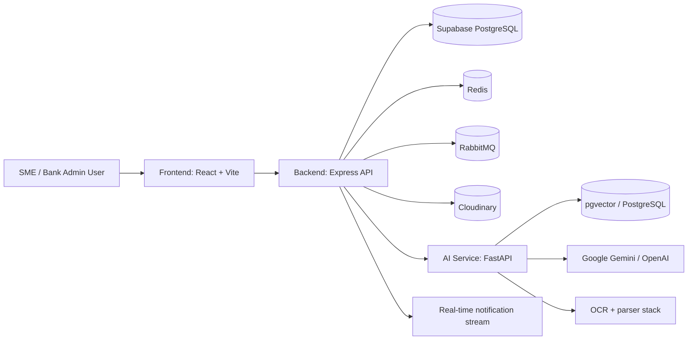
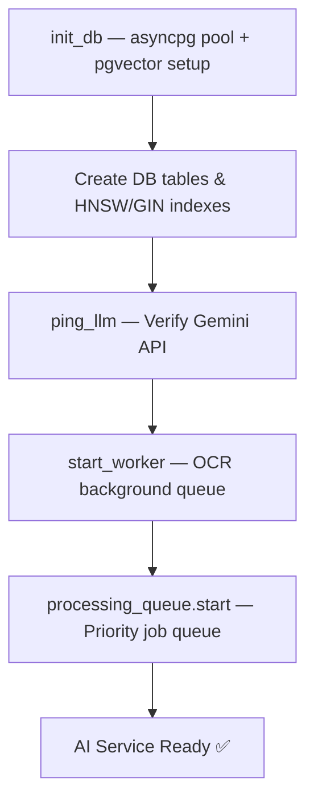
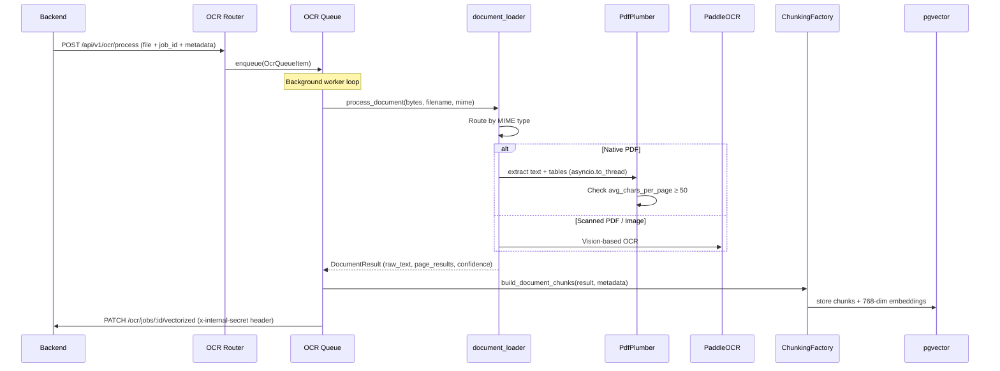
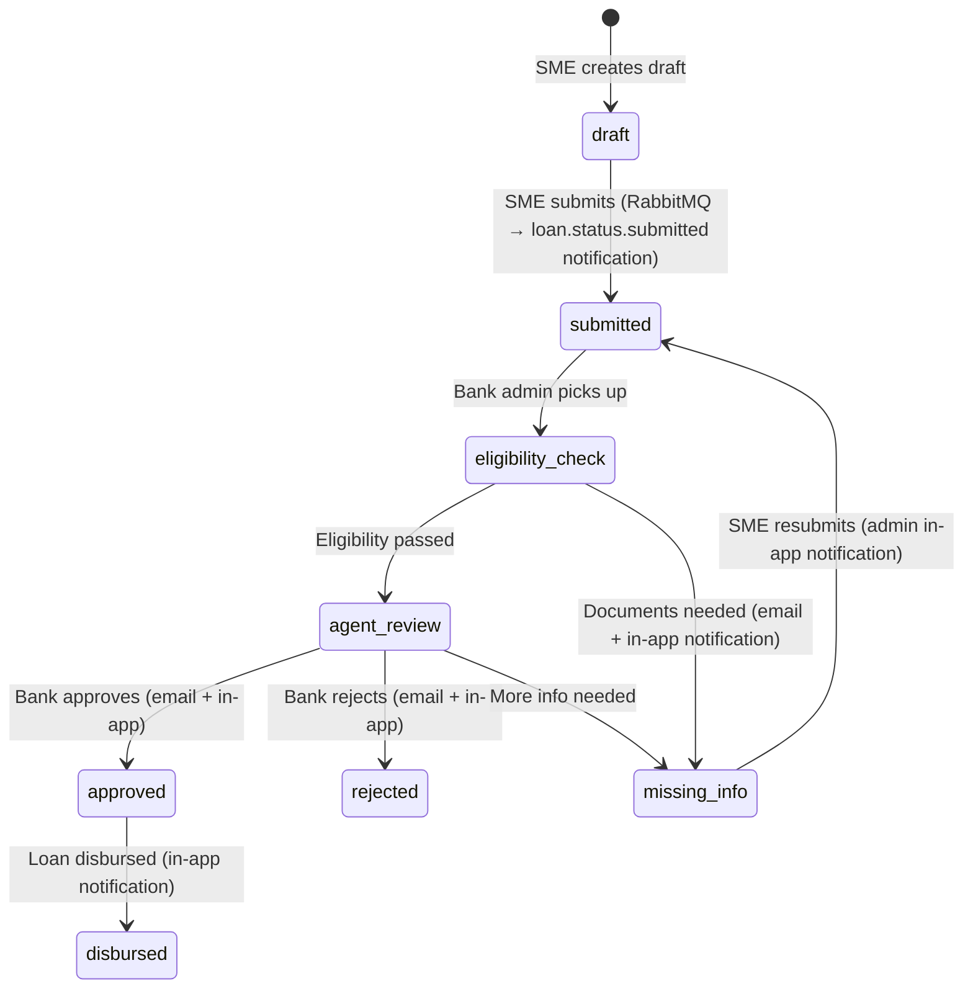

# CapitalScale — Project Report

> AI-powered SME loan underwriting platform built as a monorepo with a React frontend, Node.js/Express backend, and Python FastAPI AI services.

## Technology Stack (Detailed)

###  Frontend

| Technology | Version | Purpose |
|---|---|---|
| React | 18.3.1 | Core UI framework |
| Vite | 5.2.13 | Build tool & dev server |
| Tailwind CSS | 3.4.4 | Utility-first styling |
| shadcn/ui (Radix) | Multiple | Accessible UI component primitives |
| Zustand | 4.5.2 | Lightweight global state management |
| React Router DOM | 6.23.1 | Client-side routing |
| Axios | 1.7.2 | HTTP client with request/response interceptors |
| React Hook Form | 7.52.0 | Form state management |
| Lucide React | 0.395.0 | Icon library |
| React Markdown | 10.1.0 | Markdown rendering for AI chat responses |
| EventSource (native) | Browser API | SSE connection in `NotificationContext.jsx` |

###  Backend

| Technology | Version | Purpose |
|---|---|---|
| Express.js | 4.19.2 | HTTP framework |
| Supabase JS | 2.108.2 | PostgreSQL client via Supabase |
| amqplib | 2.0.1 | RabbitMQ AMQP 0-9-1 client |
| Argon2 | 0.44.0 | Password hashing (memory-hard, GPU-resistant) |
| JSON Web Token | 9.0.2 | JWT generation & verification (3-secret, audience-scoped) |
| ioredis | 5.11.1 | Redis client — sessions, blacklist, Pub/Sub, email rate limit |
| nodemailer | 9.0.3 | SMTP email sending (consumed by OTP & email workers) |
| Cloudinary | 2.2.0 | Cloud file storage |
| Multer | 2.0.0 | Multipart file upload (memory storage, 50MB limit) |
| Zod | 3.23.8 | Runtime environment & request schema validation |
| Helmet | 7.1.0 | Security headers (CSP, HSTS, X-Frame-Options) |
| Winston | 3.13.0 | Structured JSON logging with daily rotation |
| Morgan | 1.10.0 | HTTP request access logging |
| express-rate-limit | 7.3.1 | API rate limiting (global, auth, OTP buckets) |
| uuid | 11.0.0 | UUID v4 generation for JTI, correlation IDs |

### AI Services (Python)

| Technology | Purpose |
|---|---|
| FastAPI | Async HTTP framework with lifespan context manager |
| asyncpg | PostgreSQL async driver (connection pooling min 5 / max 20) |
| PaddleOCR v4 (2.7.3) | Deep-learning OCR for images and scanned PDFs |
| pdfplumber 0.11.4 | Native PDF text + table extraction (Markdown table output) |
| pdf2image + Pillow | PDF-to-image conversion for scanned PDF fallback |
| python-docx | DOCX document parsing |
| Google Generative AI 0.8.3 | Gemini `gemini-1.5-pro`, `gemini-2.5-flash`, `text-embedding-004` |
| OpenAI 1.59.3 | `gpt-4o-mini` fallback LLM |
| sentence-transformers | CrossEncoder `ms-marco-MiniLM-L-6-v2` for re-ranking |
| pgvector | Vector similarity search in PostgreSQL |
| tenacity | Retry logic for LLM/OCR transient failures |
| json-repair | Fixes truncated/broken JSON from LLM responses |
| Loguru | Structured logging with rotation and compression |
| Uvicorn | ASGI server (single worker for sequential processing queue) |
| httpx + aiohttp | Async HTTP clients for backend callbacks |

### Infrastructure

| Component | Technology | Notes |
|---|---|---|
| Database | PostgreSQL (Supabase-hosted) | Backend uses Supabase JS; AI uses asyncpg directly |
| Vector Store | pgvector extension | HNSW index (m=16, ef_construction=64) + GIN trigram index |
| Session Store | Redis | `session:<jti>` with 30-day TTL |
| Token Blacklist | Redis | `blacklist:token:<jti>` with 30-day TTL; fail-safe deny on Redis down |
| Email Rate Limit | Redis | Sliding window per-minute; `OTP_RATE_RESERVE` slots for OTP |
| Real-time Pub/Sub | Redis | `sse:user:<userId>` channels for multi-instance SSE sync |
| Message Broker | RabbitMQ (CloudAMQP) | Managed externally; Docker container commented out |
| File Storage | Cloudinary | Loan documents uploaded via `upload_stream` |
| Containerization | Docker + Docker Compose | 4 services: Redis, Backend, AI, Frontend |
| Cloud Deployment | Render.com + Vercel | Frontend on Vercel; Backend + AI on Render (Docker) |

---

## 1. Executive summary

CapitalScale is a full-stack application for managing SME loan applications, from onboarding and document upload to AI-driven document processing and underwriting review. The system combines:

- a React interface for SME and bank admin workflows
- an Express backend for authentication, authorization, loan management, notifications, and audit logging
- a Python AI microservice for OCR, retrieval, extraction, and underwriting
- Redis and RabbitMQ for real-time user notifications and asynchronous tasks
- PostgreSQL/Supabase for persistence and pgvector for document chunk storage

The project is structured as a multi-service monorepo rather than a single app. The codebase is oriented around a real workflow that exists in the implementation:

1. SME creates a draft or loan application
2. SME uploads supporting documents
3. OCR and AI extraction process uploaded files
4. Underwriting checks evaluate the loan against bank rules
5. Bank admin reviews the result and changes the status
6. Notifications are sent through emails and in-app updates

---

## 2. Actual repository structure

The repo currently contains the following code areas:

```text
CapitalScale/
├── frontend/                 # React + Vite app
├── backend/                  # Express API
├── ai-services-python/       # FastAPI AI service
├── README.md                 # project overview
├── project_report.md         # reporting document
├── render.yaml               # deployment config
├── package.json              # root workspace config
├── node_modules/             # installed dependencies
├── flow_diagram.jpeg         # architecture image
├── SME_Loan_Eligibility_and_Policies.pdf
├── CapitalScale_Bank_SME_Loan_Policy_2025.pdf
└── additional docs ...
```

Important implementation note: the root `package.json` declares workspaces as `frontend`, `backend`, and `ai-services`, but the actual folder on disk is `ai-services-python`. This mismatch is real and should be treated as an operational repo inconsistency.

---

## 3. High-level architecture



### Main architectural split

- Frontend: user interface and role-based access flow
- Backend: session auth, business logic, API gateway, notification bus, loan lifecycle
- AI service: OCR queue, structured extraction, retrieval, embeddings, and underwriting orchestration

This is not a pure microservice ecosystem in the strict sense; it behaves more like a layered application with service boundaries and async event-driven components.

---

## 4. Frontend application

The frontend lives in `frontend/src` and is built with Vite + React.

### 4.1 Key frontend modules

| Area | Purpose |
|---|---|
| `src/App.jsx` | Route setup and guest/protected route guards |
| `src/context/AuthContext.jsx` | login, registration, refresh, MFA flow, logout |
| `src/context/NotificationContext.jsx` | SSE connection and notification polling |
| `src/store/authStore.js` | Zustand auth state with persisted user and in-memory access token |
| `src/api/` | Axios client and API modules for auth, notifications, etc. |
| `src/pages/` | Login, dashboard, SME/bank flows, loan application page |
| `src/components/` | reusable UI and protected route wrappers |

### 4.2 Routes implemented in code

The actual route map in `frontend/src/App.jsx` is:

- `/` and `/login` — public portal selector
- `/sme/login` — SME sign in
- `/sme/register` — SME registration
- `/bank/login` — bank admin login
- `/bank/register` — bank admin registration
- `/dashboard` — protected dashboard
- `/loan/apply` — protected SME-only loan application page
- `/unauthorized` — public unauthorized page

### 4.3 Auth model in the frontend

The frontend uses Zustand and a custom `AuthContext`:

- `user` is persisted in localStorage
- `accessToken` is intentionally kept in memory only
- session hydration calls `/auth/refresh` on startup
- refresh token is handled as an HTTP-only cookie automatically sent by the browser
- login flows are role-aware (`sme` vs `bank_admin`)
- MFA verification is supported through a temp token flow after login

This is a security-focused design: the access token never sits in localStorage, which reduces XSS exposure.

### 4.4 Notification consumer in the frontend

`NotificationContext.jsx` does the following:

- loads notification list via REST API
- opens `EventSource` to `/api/v1/notifications/sse?token=...`
- listens for incoming notification events
- updates unread count and notification list in real time
- falls back to polling every 30 seconds if SSE is lost

This makes the app feel real-time while still being resilient to dropped streaming connections.

---

## 5. Backend architecture

The backend is under `backend/src` and starts from `backend/server.js`.

### 5.1 Startup flow

The real server lifecycle is:

1. validate env via `src/config/env.js`
2. initialize Cloudinary
3. initialize SSE manager
4. verify SMTP connectivity
5. connect to RabbitMQ and start workers
6. start the Express app
7. listen on `PORT` and set long timeout
8. handle graceful shutdown

One important behavior is that RabbitMQ is treated as optional. If RabbitMQ is unavailable, the backend still starts in direct-email fallback mode instead of crashing.

### 5.2 Express app composition

`backend/src/app.js` sets up:

- Helmet security headers
- CORS with allowed localhost and production origins
- JSON and URL-encoded body parsing
- cookie parser
- request logger
- global rate limiter
- versioned API router
- health root endpoint
- 404 handler
- centralized error handler

### 5.3 Route groups

`backend/src/routes/index.js` mounts these route groups:

- `/api/health` — backend health endpoint
- `/api/v1/auth` — login, registration, MFA, refresh, logout
- `/api/v1/loans` — loan lifecycle, drafts, status transfer, document upload
- `/api/v1/users` — user-related endpoints
- `/api/v1/banks` — bank-related access
- `/api/v1/bank-policies` — policy management routes
- `/api/v1/ocr` — OCR job processing and monitoring
- `/api/v1/extraction` — extraction workflow
- `/api/v1/underwriting` — AI assessment endpoints
- `/api/v1/audit-logs` — audit access
- `/api/v1/notifications` — notification feeds and SSE endpoints

### 5.4 Security and authorization model

The backend has JWT protection using `protect` and role checks via `authorizeRoles`, with `ROLES` containing values such as:

- `sme`
- `bank_admin`
- `super_admin`

Some service logic also mentions `bank_underwriter`, but the visible frontend auth model primarily exposes `sme`, `bank_admin`, and `super_admin`.

The auth layer also includes:

- Redis-backed session checks
- JWT audience segmentation
- separate MFA secret
- fail-safe blacklist logic
- OTP locking to prevent race conditions on verification

---

## 6. Loan workflow and business logic

The main business workflow is handled in `backend/src/services/loan.service.js` and `backend/src/controllers/loan.controller.js`.

### 6.1 Draft and submission flow

A loan follows a staged lifecycle:

- `draft`
- `submitted`
- `eligibility_check`
- `agent_review`
- `missing_info`
- `approved`
- `rejected`
- `disbursed`

The service validates transitions and blocks invalid status changes. It also enforces bank ownership checks for bank users.

### 6.2 Document upload flow

The flow is more complete than a simple file upload:

- SME uploads a file to a loan draft or a missing-info case
- file is uploaded to Cloudinary
- OCR job is triggered with metadata
- document metadata is attached to the loan record
- old documents are cleaned up if replaced
- uploaded chunks may be removed from pgvector when the document is deleted

This is a meaningful part of the application because the platform is not only collecting forms; it is also indexing uploaded documents for search and underwriting retrieval.

### 6.3 Validation logic before submission

`submitLoanApplication()` checks that required fields are filled, such as:

- business information
- financial information
- loan parameters
- mandatory uploaded document types
- behavioural questions

If the application is missing required fields, it returns a clear validation error before submission.

### 6.4 Status transitions and notifications

When a status changes, the system:

- updates the loan status in the database
- records a status history row
- identifies the actor and model
- publishes a notification event if relevant
- triggers email/in-app updates for the SME or bank admin

This makes the system usable as a proper operational workflow rather than only a document portal.

---

## 7. Notification system

The notification architecture is implemented in `backend/src/notifications` and is active in real code.

### 7.1 Messaging and queue setup

`backend/src/config/rabbitmq.js` declares:

- exchange: `capitalscale.notifications`
- exchange: `capitalscale.dlx`
- queue: `otp_queue`
- queue: `notification_queue`
- dead-letter queue: `dead_letter_queue`

Priorities are configured:

- OTP queue: priority 10
- notification queue: priority 5

This is real and important because the backend uses RabbitMQ for async notifications and fallback email delivery.

### 7.2 Notification flow

The typical flow is:

- a service publishes an event
- RabbitMQ routes it to the relevant queue
- a worker consumes it
- it sends SMTP email or in-app notification
- SSE pushes the notification to the connected frontend client
- Redis Pub/Sub supports multiple app instances

### 7.3 Frontend-real-time behavior

The frontend `NotificationContext` opens an SSE stream using the backend route `/api/v1/notifications/sse` and listens for new notification events in real time. This is a key user-facing feature and is explicitly wired into the app.

---

## 8. AI Service and processing pipeline

The Python service is in `ai-services-python` and starts from `main.py`.

### 8.1 FastAPI app startup

The app does the following on startup:

- loads environment variables
- initializes PostgreSQL pool
- pings the LLM service
- starts the OCR worker
- starts the processing queue

The startup logic includes graceful degraded mode: if the database or Gemini endpoint is unavailable, the service still boots but reports degraded functionality instead of crashing.

### 8.2 AI routers

Actual router files present in the codebase:

- `routers/ocr.py` — process and monitor OCR jobs
- `routers/extraction.py` — run extraction jobs
- `routers/underwriting.py` — enqueue underwriting assessment
- `routers/chat.py` — loan and policy chat endpoints
- `routers/queue.py` — queue management
- `routers/embed.py` — embedding generation endpoint

### 8.3 OCR and document processing

The backend calls the AI service for OCR and extraction jobs. The actual OCR router accepts uploaded files and pushes them into a queue. The architecture supports:

- file-based document jobs
- tracking by `job_id`
- retry for failed jobs
- document metadata including `application_id`, `document_type`, and `document_url`

### 8.4 Retrieval and embedding system

The codebase includes:

- `services/rag/` — retrieval logic and chunking
- `services/vectordb/` — pgvector storage and search
- `services/llm/` — LLM facade with Gemini and fallback OpenAI
- `services/underwriting/` — underwriting rules and scoring logic

This indicates the project is built to process uploaded financial documents, chunk them, embed them into pgvector, and then use LLM + retrieval to answer questions or assess risk.

### 8.5 Underwriting invocation

The underwriting route enqueues an assessment job and returns a `job_id` with queued status. This shows the application is designed for asynchronously processed proofing and review rather than synchronous one-shot underwriting.

---

## 9. Data and storage layer

### 9.1 Database and storage

- PostgreSQL via Supabase is used for operational and app data
- asyncpg is used from the Python service for direct DB access
- Cloudinary stores uploaded documents
- pgvector stores embeddings and chunked document context
- Redis stores JWT/session/blacklist state and notification Pub/Sub state

### 9.2 Key data patterns in the codebase

The application stores:

- users and role metadata
- SME and bank admin records
- loan drafts and loan application records
- document metadata and file URLs
- OCR jobs and status tracking
- status history for loans
- notification records and audit logs
- vectorized document chunks for retrieval

This is a strong indicator that the platform is designed as a real business workflow system, not just a demo UI.

---

## 10. Security and resilience notes

### Security controls present in code

- JWT-based protected APIs
- role-based route guards
- OTP verification with Redis locks
- HMAC-based OTP storage strategy
- Cloudinary file storage rather than raw local file handling
- CORS configuration with origin allowlist
- request validation using Zod on the backend
- internal secret checks for AI-to-backend callbacks
- fail-safe token blacklist logic if Redis is down

### Graceful-degradation behavior

The code is designed to continue running even when certain infrastructure components are offline:

- RabbitMQ can be unavailable and the server still runs
- SMTP can fail or be absent and the app still starts
- database connectivity issues in AI service are logged and app starts in degraded mode

This is a practical reliability choice for local development and partial deployment.

---

## 11. Real strengths of the codebase

The strongest aspects of the implementation are:

- comprehensive user flow from SME application to bank decision
- real notification pipeline with SSE and async messaging
- Stable layered architecture across frontend/backend/AI service
- role-aware UI and API permission checks
- explicit handling of document lifecycle and OCR-based processing
- use of external storage and vector search for AI-driven retrieval
- structured audit logging and loan history support

---

## 12. Observed inconsistencies and gaps

These are important if someone is documenting or maintaining the project:

1. Root workspace config references `ai-services`, while the actual folder is `ai-services-python`.
2. Some code comments reference older or planned behavior, while the actual app is more conservative and gracefully degrades when optional services are unavailable.
3. Frontend exposes roles `sme`, `bank_admin`, and `super_admin`, while some backend service logic still references `bank_underwriter`.
4. Some docs mention a more standardized microservice setup than what the actual repo daily uses; the architecture is functional and layered, but not fully isolated into independent deployable services.
5. The AI service contains a significant amount of real functionality, especially around OCR, retrieval, and queueing, even though the exact UX for all endpoints is not fully surfaced in the frontend.

---

## 13. Overall assessment

CapitalScale is a serious, working-style codebase for AI-assisted lending operations. It is not just a front-end mockup. It contains:

- multi-role user flow
- secure auth model
- document upload pipeline
- async OCR and processing queue
- AI-assisted underwriting intent
- notification and SSE mechanisms
- persistence, audit trails, and operational logging

The project is closer to an internal business application or prototype platform than a simple sample app. It shows real implementation work across three layers and has a clear product logic beyond UI-only screens.

---

## 14. Recommended next documentation improvements

If this report is to be maintained long-term, the most valuable additions would be:

- an exact API contract map for all routes with request/response examples
- a sequence diagram for the full loan submission to underwriting flow
- a database schema overview for users, loans, documents, OCR jobs, notifications, and audit logs
- a deployment operations document covering local dev, environment variables, and service health checks
- a clear note explaining the mismatch between workspace naming and actual folder names

This would make the repository easier for new developers to onboard and easier to maintain in production.
```

**Email Worker Flow (notification_queue):**
1. Parse message JSON (`correlationId`, `eventType`, `payload`, `retryCount`)
2. Track job state in `email_jobs` DB table
3. If `loan.status.*` event → create in-app notification (for applicable statuses)
4. If `loan.missing_info.completed` → create admin in-app notification
5. Check if email needed (`SME_EMAIL_STATUSES`: `missing_info`, `approved`, `rejected`)
6. Acquire Redis sliding-window email rate limit slot
7. Render HTML template, send via nodemailer
8. On failure: retry up to 10 times (2s sleep between), then `nack` to DLQ

**In-App Notification Flow:**
1. `createAndDeliverInAppNotification()` — INSERT into `notifications` table
2. `publishSSEEvent(userId, data)` — publishes to Redis `sse:user:<userId>` channel
3. Redis subscriber on all instances receives message → `_pushToLocalConnections()` → HTTP response write

**Email Rate Limiting (`rateLimiter.service.js`):**
- Sliding window using Redis `INCR` + `EXPIRE` per minute epoch
- `OTP_RATE_RESERVE` (default 10) slots reserved for OTP bucket
- General emails use remaining: `EMAIL_RATE_LIMIT_PER_MINUTE - OTP_RATE_RESERVE`

#### 4.2.6 Database Query Modules (9 total)

| Module | Purpose |
|---|---|
| `users.queries.js` | SME/Bank user CRUD, role lookup, permission queries, registered banks |
| `loans.queries.js` | Loan CRUD, draft management, status history, missing info |
| `ocrJobs.queries.js` | OCR job tracking, vectorization status |
| `policies.queries.js` | Bank policy document CRUD |
| `bankAccounts.queries.js` | SME-linked bank accounts (OTP-verified linking) |
| `embeddings.queries.js` | Document chunk deletion (by source document) |
| `otps.queries.js` | OTP CRUD — store HMAC hash, increment attempts, delete |
| `auditLogs.queries.js` | Audit event recording |
| `notifications.queries.js` | Notification CRUD, unread count, mark as read |

---

### 4.3 AI Services (Python FastAPI)

#### 4.3.1 Startup Lifecycle



#### 4.3.2 OCR Pipeline (`services/ocr/`)



**Key features:**
- `avg_chars_per_page < 50` threshold detects scanned vs native PDFs
- Tables extracted by pdfplumber become Markdown (`| Header | Cell |`)
- `asyncio.to_thread()` prevents pdfplumber blocking the async event loop
- Callback protected by `requireInternalSecret` middleware (fixes security vulnerability)

#### 4.3.3 Domain-Aware Chunking (`services/rag/chunking/`)

| Document Type | Strategy | Max Tokens | Overlap | Key Logic |
|---|---|---|---|---|
| Bank Policy | `BankPolicySemanticStrategy` | 800 | 0 | Exception/Note gluing; chapter hierarchy |
| Bank Statement | `BankStatementStrategy` | 550 | 80 | Table row grouping (`\|`, `\t`, double-space) |
| Tax Return / ITR | `TaxReturnStrategy` | 600 | 80 | Financial table preservation |
| Financial Statement | `FinancialTableStrategy` | 600 | 80 | P&L / Balance sheet row protection |
| Pay Stub | `PayStubStrategy` | 450 | 60 | Dense numerical chunk sizing |
| Appraisal / Valuation | `AppraisalStrategy` | 800 | 120 | Narrative + table mix |
| Identity Document | `IdentityImageStrategy` | 350 | 40 | Small target for high signal density |
| General / Unknown | `NarrativeDocumentStrategy` | 750 | 100 | Paragraph-based splitting |

**`StructuredFactExtractor`** — Injects extracted entities (names, amounts, dates, IDs) directly into chunk `metadata` JSONB for deterministic exact-match retrieval fallback.

**Orphan merging** — Chunks < 40 tokens (`CARRY_FORWARD_MAX_TOKENS`) are carried into the next group, preventing isolated noise chunks.

#### 4.3.4 Parameter Extraction (`services/extraction/`)

Extracts 30+ financial parameters from loan documents using multi-stage LLM reasoning:

1. **Query cache warm-up** — Pre-embeds 6 underwriting question categories (annual_revenue, gst_turnover, business_age, cash_flow, existing_loans, policy_compliance)
2. **Batch retrieval** — Fetches evidence for each question using cached embeddings + `query_similar_chunks()`
3. **Context merging** — Contiguous chunks from same page/doc merged to reduce LLM context fragmentation
4. **First pass LLM extraction** — Gemini 1.5 Pro extracts parameters with confidence scores
5. **Verification agent** (optional) — Second LLM pass cross-checks extracted values against source
6. **Missing field detection** — Callback to backend marks loan as `missing_info` when required fields are absent

#### 4.3.5 AI Underwriting Assessment (`services/underwriting/`)

1. Load extracted parameters from `extracted_parameters` table
2. Retrieve active `policy_rules` for the applicant's bank
3. Construct structured evaluation prompt (parameters + rules)
4. Gemini evaluates each rule → per-rule pass/fail/inconclusive + reasoning
5. Generate overall risk score (0–100) and decision (Approve / Reject / Refer)
6. Store assessment + audit log

#### 4.3.6 RAG Chat (`routers/chat.py`)

Two chat interfaces, both strictly grounded (refuses to answer outside provided context):

| Chat Type | Endpoint | Retrieval Strategy |
|---|---|---|
| Loan Document Chat | `/api/v1/chat/loan/{application_id}` | Cosine similarity on loan's embedded chunks |
| Policy Chat | `/api/v1/chat/policy/{bank_id}` | Two-stage: vector search (top-40) → CrossEncoder rerank (top-10) |

Both return structured JSON: `{ answer, reasoning, found_in_context, sources }`.

#### 4.3.7 CrossEncoder Re-Ranking (`services/vectordb/reranker.py`)

- Model: `cross-encoder/ms-marco-MiniLM-L-6-v2` (via `sentence-transformers`)
- Lazy-loaded on first use — `asyncio.Lock()` prevents double-initialization
- `CrossEncoder.predict()` runs in `asyncio.to_thread()` — never blocks the event loop
- Disabled gracefully if model fails to load (`is_enabled = False` fallback)

#### 4.3.8 Processing Queue (`services/processing_queue.py`)

| Feature | Detail |
|---|---|
| **Execution** | Sequential (one job at a time) — respects LLM rate limits |
| **Priority** | Higher-priority jobs execute first |
| **Job types** | `extraction`, `underwriting`, `full_pipeline` (chains both) |
| **Status tracking** | `pending` → `running` → `completed` / `failed` |
| **Persistence** | `loan_processing_jobs` PostgreSQL table |
| **Skip exemption** | `/queue/status` exempt from rate limiter + request logger |

#### 4.3.9 LLM Facade & Rate Limiting (`services/llm/`)

- **Unified interface** — `llm_facade.py` exposes `chat()`, `embed()`, `ping()` — all callers share one rate limiter
- **Providers**: `gemini.py` (primary — Gemini 1.5 Pro + 2.5 Flash + text-embedding-004), `openai.py` (fallback — GPT-4o-mini)
- **Rate limiter**: Async token-bucket managing free-tier quota (~15 req/min for Gemini)
- **Embedding cache**: `query_embedding_cache` PostgreSQL table prevents redundant API calls for standard underwriting questions

#### 4.3.10 Vector Database (`services/vectordb/pgvector_service.py`)

Indexes maintained on `document_embeddings`:
- `idx_doc_emb_application_id` (btree) — tenant isolation
- `idx_doc_emb_app_doctype` (composite btree) — document type filtering
- `idx_doc_emb_vector_hnsw` (HNSW, m=16, ef_construction=64) — approximate nearest neighbor
- `idx_doc_emb_chunk_text_trgm` (GIN trigram) — keyword fallback search
- `idx_doc_emb_structured_facts` (GIN JSONB) — structured fact exact-match queries

---

## 5. Database Schema

### Core Tables (PostgreSQL via Supabase)

| Table | Purpose |
|---|---|
| `sme_users` | SME applicant accounts (Argon2 hashed passwords) |
| `bank_admin_users` | Bank administrator accounts |
| `roles` | RBAC role definitions (`sme_applicant`, `bank_underwriter`, `super_admin`) |
| `role_permissions` | Permission mappings per role |
| `permissions` | Granular permission definitions |
| `loans` | Loan applications — status, documents, AI results, progress |
| `loan_status_history` | Full state transition log with actor and timestamp |
| `bank_accounts` | SME-linked bank accounts (OTP-verified) |
| `bank_policy_documents` | Uploaded bank policy PDF metadata |
| `otps` | MFA OTP records — stores HMAC-SHA256 hash, attempts counter, expiry |
| `audit_logs` | Platform audit trail (actor, action, IP, user agent, status) |
| `ocr_jobs` | OCR processing job tracking |
| `notifications` | In-app notification records (user_id, type, title, message, is_read) |
| `email_jobs` | Email delivery tracking (correlationId, status, retry_count, error_message) |

### AI Tables (Managed by Python Service)

| Table | Purpose |
|---|---|
| `document_embeddings` | Vectorized document chunks (pgvector, 768-dim) + metadata JSONB |
| `extracted_parameters` | AI-extracted financial parameters per loan |
| `loan_processing_jobs` | Processing queue state (extraction/underwriting jobs) |
| `query_embedding_cache` | Cached query embeddings for underwriting questions |
| `policy_rules` | Extracted underwriting rules per bank |
| `policy_extraction_audit` | Audit trail for policy rule extraction |
| `underwriting_audit_logs` | Detailed AI assessment audit records |
| `rule_relationships` | Inter-rule dependencies and hierarchy |

---

## 6. End-to-End Workflow: Loan Application Lifecycle



**Step-by-step:**
1. SME registers → MFA OTP via RabbitMQ email
2. Creates loan draft → selects partner bank
3. Uploads documents → Cloudinary storage → OCR queued → vectorized
4. Submits application → RabbitMQ publishes `loan.status.submitted`
5. Bank admin reviews → triggers AI extraction (processing queue job)
6. AI parameters extracted → underwriting auto-triggered → risk score generated
7. Bank admin reviews AI report → uses RAG chat for document questions
8. Bank decision → `loan.status.approved/rejected` published → email + in-app notification via SSE

---

## 7. Security Architecture

| Layer | Mechanism |
|---|---|
| **Password Hashing** | Argon2id (memory-hard) |
| **MFA** | Email OTP (HMAC-SHA256 stored), 5m expiry, 3-attempt lockout |
| **OTP Race Condition** | Redis distributed lock (`SET NX EX`) prevents concurrent brute-force |
| **JWT Architecture** | 3 separate secrets + audience claims (`access`, `refresh`, `mfa`) |
| **Token Rotation** | Refresh tokens single-use; old JTI blacklisted immediately |
| **Reuse Detection** | Blacklisted token reuse logs `security.token_reuse_fraud` audit event |
| **Redis Fail-safe** | `isTokenBlacklisted()` returns `true` (deny) when Redis is unavailable |
| **Session Management** | Redis-backed with 30-day TTL; instant revocation on logout |
| **SSE Auth** | Token passed as query param (EventSource limitation); `protect` middleware validates |
| **Internal Callbacks** | `x-internal-secret` header guards all AI→backend webhook endpoints |
| **API Security** | Helmet, CORS origin whitelist, rate limiting |
| **Input Validation** | Zod (backend), Pydantic (AI services) |
| **Cookie Security** | httpOnly, secure, sameSite, path-scoped to `/api/v1/auth` |
| **Audit Logging** | Every significant action logged with IP, user agent, actor, timestamp |

---

## 8. Deployment Architecture

### Docker Compose (Development)

| Service | Container | Port | Notes |
|---|---|---|---|
| Redis | `ai_loan_redis` | 6379 | Session store, token blacklist, SSE Pub/Sub, email rate limit |
| Backend | `ai_loan_backend` | 5000 | Node.js Express + all notification workers |
| AI Services | `ai_loan_ai_services` | 5001 | Python FastAPI + PaddleOCR model cache volume |
| Frontend | `ai_loan_frontend` | 3000 | Vite dev server |

**Note:** RabbitMQ container is commented out in `docker-compose.yml` — production uses CloudAMQP externally via `RABBITMQ_URL` env var.

### Production

| Service | Platform |
|---|---|
| Frontend | **Vercel** |
| Backend | **Render.com** (Docker-based, `render.yaml`) |
| AI Services | **Render.com** (Docker-based, PaddleOCR model cache volume) |
| Database | **Supabase** (managed PostgreSQL + pgvector) |
| File Storage | **Cloudinary** |
| Redis | Managed Redis provider |
| RabbitMQ | **CloudAMQP** (managed) |

---

## 9. Project Statistics

| Metric | Value |
|---|---|
| **Total tiers** | 3 (Frontend, Backend, AI Services) |
| **Backend controllers** | 9 (including NotificationController) |
| **Backend services** | 7 |
| **Backend middleware** | 6 (including `requireInternalSecret`) |
| **Backend DB query modules** | 9 (including notifications.queries.js) |
| **Backend route groups** | 10 |
| **Notification workers** | 3 (OTP Worker, Email Worker, DLQ Processor) |
| **Email templates** | 5 (OTP, loanApproved, loanRejected, missingInfo, missingInfoCompleted) |
| **Notification event types** | 10 (defined in NOTIFICATION_EVENTS) |
| **AI service routers** | 6 (OCR, extraction, underwriting, chat, embed, queue) |
| **AI service modules** | 8+ (OCR, RAG chunking, retrieval, extraction, underwriting, vectordb, LLM, processing queue) |
| **Chunking strategies** | 8 (BankPolicy, BankStatement, TaxReturn, PayStub, Appraisal, Financial, Identity, Narrative) |
| **Frontend pages** | 10 |
| **Frontend API modules** | 8 (including notification.api.js) |
| **Frontend hooks** | 4 (useIdleTimeout, useNotifications, useApi, useRequireAuth) |
| **LLM providers** | 2 (Gemini primary, OpenAI fallback) |
| **Database tables** | ~22 |
| **Docker services** | 4 (RabbitMQ external via CloudAMQP) |

---

## 10. Key Design Decisions & Patterns

| Decision | Rationale |
|---|---|
| **RabbitMQ over direct SMTP in service** | Decouples email delivery from request path; OTP queue gets priority 10 ensuring instant delivery even under load |
| **SSE + Redis Pub/Sub over WebSockets** | SSE is unidirectional (sufficient for notifications); stateless HTTP avoids sticky session complexity; Redis Pub/Sub enables horizontal scaling |
| **3 JWT secrets with audience claims** | Prevents cross-token attacks; an MFA token cannot be used as an Access token even if stolen |
| **Redis fail-safe deny on blacklist check** | Security > Availability; a Redis outage cannot be exploited to replay revoked tokens |
| **OTP as HMAC-SHA256 hash** | DB read access cannot recover OTP codes; timing-safe comparison prevents timing attacks |
| **Redis distributed OTP lock** | Prevents concurrent MFA verification race conditions that could bypass 3-attempt lockout |
| **Domain-specific chunking strategies** | Generic splitters destroy financial tables; custom strategies are cheaper and more accurate than LLM-based semantic chunking |
| **CrossEncoder reranking** | Vector similarity finds "related" chunks; CrossEncoder finds "contextually relevant" chunks for precise underwriting |
| **Query embedding cache** | 6 standard underwriting questions are pre-embedded once — saves LLM API calls on every assessment |
| **Sequential processing queue** | Prevents LLM rate limit exhaustion; deterministic execution order |
| **asyncio.to_thread() for blocking ops** | pdfplumber and CrossEncoder are sync/CPU-bound; running them in worker threads keeps FastAPI event loop free |
| **`x-internal-secret` for callbacks** | Fixes security gap where AI→backend webhook endpoints were publicly accessible |
| **Fire-and-forget audit logs** | `.catch(() => {})` ensures audit failures never block user operations |
| **Monorepo with npm workspaces** | Single repo for all three tiers; simpler CI/CD and dependency management |

---

## 11. Summary

CapitalScale is a **sophisticated, production-ready platform** that digitizes and automates the SME loan underwriting process. It combines:

- **Modern web technologies** (React 18, Express.js, FastAPI) for responsive UX
- **AI/ML capabilities** (PaddleOCR, Gemini LLM, pgvector, CrossEncoder RAG) for intelligent document processing
- **Enterprise-grade security** (Argon2, 3-secret JWT, Redis blacklisting, OTP hashing, audit logging)
- **Event-driven architecture** (RabbitMQ, SSE, Redis Pub/Sub) for resilient async communication
- **Scalable infrastructure** (Docker, Supabase, CloudAMQP, Render) for production workloads

The three-tier design cleanly separates concerns: the frontend handles UX and real-time state, the backend manages business logic and event orchestration, and the AI service focuses purely on ML workloads — making each tier independently scalable and maintainable.
